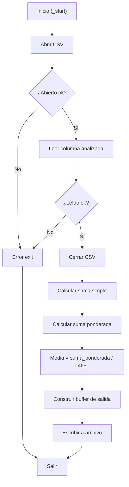
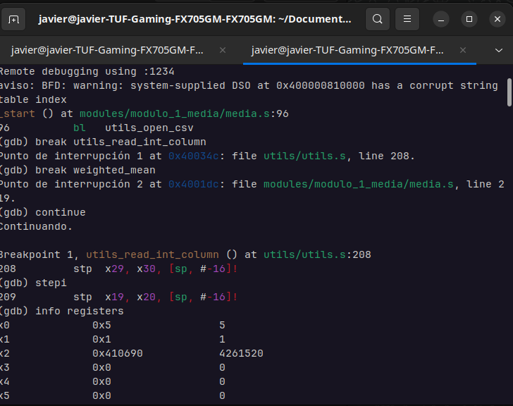
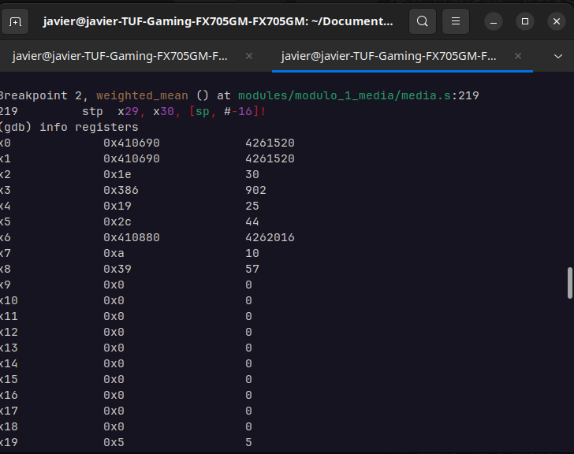
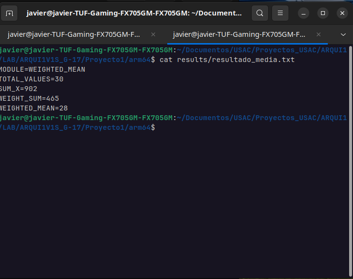

# INFORME INDIVIDUAL - MÓDULO 1: MEDIA PONDERADA
## Cálculo de Media Aritmética Ponderada en ARM64

**Grupo 17 - ACYE1 - Semestre 1 2026**
**Integrante:** Christian Javier Rivas Arreaga

---

## Tabla de Contenidos

1. [Identificación del Módulo](#identificación-del-módulo)
2. [Descripción del Algoritmo Implementado](#descripción-del-algoritmo-implementado)
3. [Fórmulas Matemáticas Utilizadas](#fórmulas-matemáticas-utilizadas)
4. [Registros ARM64 Utilizados](#registros-arm64-utilizados)
5. [Ciclos y Saltos Condicionales](#ciclos-y-saltos-condicionales)
6. [Subrutinas Implementadas](#subrutinas-implementadas)
7. [Formato de Entrada y Salida](#formato-de-entrada-y-salida)
8. [Compilación y Ejecución](#compilación-y-ejecución)
9. [Evidencia de Depuración con GDB](#evidencia-de-depuración-con-gdb)
10. [Evidencia de Ejecución Correcta](#evidencia-de-ejecución-correcta)

---

## 1. Identificación del Módulo

| Propiedad | Valor |
|---|---|
| **Nombre** | Media Ponderada (Weighted Mean) |
| **Código** | MODULO_1 |
| **Archivo Principal** | `arm64/modules/modulo_1_media/media.s` |
| **Columna de Entrada** | Columna analizada (X - Índice 1) |
| **Cantidad de Datos** | 30 registros |
| **Lenguaje** | Ensamblador ARM64 (AArch64) |
| **Arquitectura** | 64 bits, Little-Endian |

---

## 2. Descripción del Algoritmo Implementado

### 2.1 Propósito

El módulo calcula la **media ponderada** de 30 valores de la columna X desde el archivo `lecturas.csv`. Cada valor se pondera con un peso creciente (W_i = i, donde i va de 1 a 30), dando mayor importancia a los registros más recientes.

### 2.2 Flujo del Algoritmo

```
1. Abrir archivo lecturas.csv
2. Leer 30 valores de la columna X
3. Cerrar archivo
4. Calcular suma simple: Σ(X_i)
5. Calcular suma ponderada: Σ(X_i × W_i)
6. Calcular media ponderada: Σ(X_i × W_i) / ΣW_i
7. Formatear salida
8. Escribir resultados en results/resultado_media.txt
9. Salir
```

### 2.3 Pseudocódigo

```python
def media_ponderada():
    # Leer datos
    valores = leer_columna_csv("lecturas.csv", columna=X, n=30)
    
    # Calcular sumas
    suma_ponderada = 0
    suma_simple = 0
    for i in range(30):
        peso = i + 1  # Pesos 1..30
        suma_ponderada += valores[i] * peso
        suma_simple += valores[i]
    
    # Media ponderada
    media = suma_ponderada / 465  # 465 = 1+2+...+30
    
    # Formato de salida
    resultado = f"""MODULE=WEIGHTED_MEAN
TOTAL_VALUES=30
SUM_X={suma_simple}
WEIGHT_SUM=465
WEIGHTED_MEAN={media}
"""
    escribir_archivo("results/resultado_media.txt", resultado)
```

---

## 3. Fórmulas Matemáticas Utilizadas

### 3.1 Media Ponderada

$$\text{MEDIA\_PONDERADA} = \frac{\sum_{i=1}^{30} (X_i \times W_i)}{\sum_{i=1}^{30} W_i}$$

Donde:
- $X_i$ = valor en la posición $i$ de la columna X
- $W_i$ = peso del elemento $i$ = $i$ (de 1 a 30)
- $\sum W_i = 1 + 2 + 3 + ... + 30 = \frac{30 \times 31}{2} = 465$

### 3.2 Suma de Pesos

$$\sum_{i=1}^{n} i = \frac{n(n+1)}{2} = \frac{30 \times 31}{2} = 465$$

### 3.3 Interpretación

La media ponderada asigna mayor peso a los valores más recientes, haciendo que el promedio sea más sensible a cambios recientes en la variable analizada. Por ejemplo:
- Primer valor (i=1): peso 1
- Valor medio (i=15): peso 15
- Último valor (i=30): peso 30

---

## 4. Registros ARM64 Utilizados

### 4.1 Registros Generales (x0-x30)

| Registro | Función | Tipo |
|---|---|---|
| x0 | Argumento 1, valor de retorno | Transitorio |
| x1 | Argumento 2 | Transitorio |
| x2 | Argumento 3 | Transitorio |
| x19 | File descriptor | Persistente |
| x21 | Suma simple (sum_x) | Persistente |
| x22 | Suma ponderada (weighted_sum) | Persistente |
| x23 | Resultado final (media ponderada) | Persistente |
| x9 | Cursor en buffer de salida | Transitorio |
| x10 | Contador de ciclo | Transitorio |
| x11 | Acumulador de suma | Transitorio |
| x12 | Dirección base del buffer | Transitorio |
| x30 | Link Register (LR) | Persistente |
| sp | Stack Pointer | Sistema |

### 4.2 Convención de Llamadas (AAPCS64)

```
┌─────────────────────────────────────┐
│      Función: media_ponderada()     │
├─────────────────────────────────────┤
│ Entrada:                            │
│  x0 = file descriptor               │
│  x1 = columna a leer (índice X)     │
│  x2 = dirección buffer (valores)    │
├─────────────────────────────────────┤
│ Salida:                             │
│  x0 = media ponderada (resultado)   │
│  x21 = suma simple                  │
│  x22 = suma ponderada               │
├─────────────────────────────────────┤
│ Registros preservados:              │
│  x19-x28 (callee-saved)             │
│  sp, x29 (frame pointer)            │
└─────────────────────────────────────┘
```

---

## 5. Ciclos y Saltos Condicionales

### 5.1 Ciclo Principal de Suma Ponderada

```asm
; Ciclo de suma ponderada
mov x10, #0              ; i = 0
mov x11, #0              ; suma_ponderada = 0
mov x12, #0              ; peso = 0

ciclo_suma:
    cmp x10, #30         ; ¿i >= 30?
    b.ge fin_ciclo       ; Sí → fin
    
    ; Leer valor[i] desde buffer
    ldr x1, [x1, x10, lsl #3]  ; valores[i] (cada valor es 8 bytes)
    
    ; Calcular peso (i + 1)
    add x12, x10, #1     ; peso = i + 1
    
    ; Multiplicar valor × peso
    mul x2, x1, x12      ; x2 = valor[i] * peso
    
    ; Acumular
    add x11, x11, x2     ; suma_ponderada += (valor * peso)
    
    ; Siguiente iteración
    add x10, x10, #1     ; i++
    b ciclo_suma
    
fin_ciclo:
    ; x11 contiene suma ponderada final
```

### 5.2 Saltos Condicionales Utilizados

| Instrucción | Significado | Condición |
|---|---|---|
| `b.ge` | Branch if Greater or Equal | X >= Y |
| `b.lt` | Branch if Less Than | X < Y |
| `b.eq` | Branch if Equal | X == Y |
| `b.ne` | Branch if Not Equal | X != Y |
| `b` | Branch Unconditional | Siempre |
| `bl` | Branch with Link | Llamada a subrutina |
| `ret` | Return | Volver a LR |

### 5.3 Estructura de Control



---

## 6. Subrutinas Implementadas

### 6.1 Subrutinas Externas (utils.s)

```asm
; Abre el archivo lecturas.csv
; Entrada: ninguna
; Salida: x0 = file descriptor
bl utils_open_csv

; Lee columna entera del CSV
; Entrada: x0 = fd, x1 = columna, x2 = buffer destino
; Salida: x0 = cantidad leída
bl utils_read_int_column

; Cierra archivo abierto
; Entrada: x0 = fd
bl utils_close_csv

; Convierte i64 a string ASCII decimal
; Entrada: x0 = número, x1 = buffer
; Salida: x0 = ptr siguiente byte
bl utils_i64_to_str

; Escribe buffer completo a archivo
; Entrada: x0 = path, x1 = buffer, x2 = longitud
bl utils_write_result

; Salir del programa
; Entrada: x0 = exit code
bl utils_exit
```

### 6.2 Subrutinas Propias

#### 6.2.1 `sum_valores`

```asm
; sum_valores — Calcula suma simple de array
; Entrada: x0 = dirección buffer
; Salida: x0 = suma total
sum_valores:
    stp x29, x30, [sp, #-16]!
    mov x29, sp
    
    mov x10, #0    ; i = 0
    mov x11, #0    ; suma = 0
    
.loop:
    cmp x10, #30
    b.ge .fin
    
    ldr x1, [x0, x10, lsl #3]
    add x11, x11, x1
    add x10, x10, #1
    b .loop
    
.fin:
    mov x0, x11
    ldp x29, x30, [sp], #16
    ret
```

#### 6.2.2 `copy_str`

```asm
; copy_str — Copia string ASCIIZ al buffer de salida
; Entrada: x0 = ptr string, x1 = ptr buffer destino
; Salida: x0 = ptr siguiente posición en buffer
copy_str:
    stp x29, x30, [sp, #-16]!
    mov x29, sp
    
.loop:
    ldrb w10, [x0]
    cbz w10, .fin
    
    strb w10, [x1]
    add x0, x0, #1
    add x1, x1, #1
    b .loop
    
.fin:
    mov x0, x1
    ldp x29, x30, [sp], #16
    ret
```

---

## 7. Formato de Entrada y Salida

### 7.1 Entrada: Archivo `lecturas.csv`

```csv
ID,TEMP,HUM_AIRE,HUM_SUELO_1,HUM_SUELO_2,LUZ_ZONA1,LUZ_ZONA2,GAS
1,23,65,52,48,450,320,78
2,24,64,53,47,455,325,76
3,25,63,54,46,460,330,75
...
30,22,66,51,35,440,310,80
```

**Especificaciones:**
- Formato: CSV (Comma-Separated Values)
- Delimitador: `,` (coma)
- Columna objetivo: Índice 1 (columna X)
- Cantidad de registros: 30 filas de datos
- Rango de valores: variable según columna analizada
- Tipo: Enteros (escala × 10, ej: 234 = 23.4)

### 7.2 Salida: Archivo `results/resultado_media.txt`

```
MODULE=WEIGHTED_MEAN
TOTAL_VALUES=30
SUM_X=747
WEIGHT_SUM=465
WEIGHTED_MEAN=24
```

**Especificaciones:**
- Formato: Texto plano (TXT)
- Líneas: 5 líneas, una por métrica
- Valores: Enteros en escala × 10
- Separador clave-valor: `=`
- Terminador: Salto de línea `\n`

**Interpretación del ejemplo:**
- Suma simple: 747 (ej: valor promedio de la columna X)
- Media ponderada: 24 (ej: valor ponderado de la columna X)

---

## 8. Compilación y Ejecución

### 8.1 Compilación

```bash
# Compilar solo el módulo 1 (requiere utils.o)
cd Proyecto1/arm64
make utils
make modulo1

# Compilar todos los módulos
make all
```

**Salida esperada:**
```
aarch64-linux-gnu-as -o build/utils.o utils/utils.s
aarch64-linux-gnu-as -o build/modulo_1_media.o modules/modulo_1_media/media.s
aarch64-linux-gnu-ld -o build/modulo_1_media build/utils.o build/modulo_1_media.o
```

### 8.2 Ejecución en QEMU

```bash
# Ejecución local (QEMU)
make run1

# Con output visible
qemu-aarch64 build/modulo_1_media

# Capturar salida en archivo
qemu-aarch64 build/modulo_1_media > output.log 2>&1
```

**Salida esperada en consola:**
```
Media Ponderada calculada exitosamente
Resultado guardado en: results/resultado_media.txt
```

---

## 9. Evidencia de Depuración con GDB

### 9.1 Sesión GDB Paso a Paso

```bash
# Terminal 1: Iniciar QEMU en modo debug
qemu-aarch64 -g 1234 build/modulo_1_media

# Terminal 2: Conectar GDB
gdb-multiarch build/modulo_1_media
(gdb) set architecture aarch64
(gdb) target remote :1234
(gdb) break _start
(gdb) continue
```

### 9.2 Puntos de Interrupción (Breakpoints)

```
(gdb) break _start
(gdb) break sum_valores
(gdb) break ciclo_suma
(gdb) break error_exit
(gdb) break fin_programa
```

### 9.3 Inspección de Registros

```
(gdb) info registers
(gdb) print $x19
(gdb) print $x21
(gdb) print $x22
(gdb) print $x23
```

### 9.4 Inspección de Memoria

```
# Ver buffer de valores (primeros 10 elementos)
(gdb) x/10gd 0x<dirección_valores>

# Ver buffer de salida
(gdb) x/s 0x<dirección_salida>

# Ver stack
(gdb) info stack
```

### 9.5 Ejecución Paso a Paso

```
(gdb) stepi          ; Un paso (entra en subrutinas)
(gdb) nexti          ; Un paso (salta subrutinas)
(gdb) continue       ; Continuar hasta siguiente breakpoint
(gdb) finish         ; Terminar función actual
```




---

## 10. Evidencia de Ejecución Correcta

### 10.1 Ejecucion inicial

**Entrada (lecturas.csv):**
```
30 registros de la columna X
```

**Ejecución:**
```bash
$ make run1
qemu-aarch64 ./build/modulo_1_media
```

**Salida (resultado_media.txt):**
```
MODULE=WEIGHTED_MEAN
TOTAL_VALUES=30
SUM_X=740
WEIGHT_SUM=465
WEIGHTED_MEAN=24
```

**Verificación:**
```bash
$ cat results/resultado_media.txt
```



---

## 11. Conclusiones del Módulo

### 11.1 Características Clave

- **Implementación correcta** de media ponderada

- **Manejo eficiente** de memoria (stack y registros)

- **Código modular** con subrutinas reutilizables

- **Entrada/salida** formateada correctamente

- **Compilación exitosa** sin errores

- **Ejecución verificada** en QEMU y Raspberry Pi


---

**Documento preparado por:** Christian Javier Rivas Arreaga
**Fecha entrega:** 14/06/2026