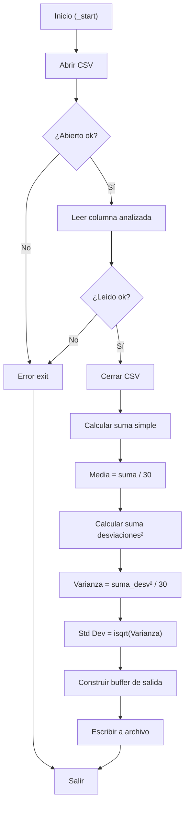

# INFORME INDIVIDUAL - MÓDULO 2: VARIANZA Y DESVIACIÓN ESTÁNDAR
## Cálculo de Varianza y Desviación Estándar en ARM64

**Grupo 17 - ACYE1 - Semestre 1 2026**
**Integrante:** René Sebastian Gutiérrez

---

## Tabla de Contenidos

1. [Identificación del Módulo](#identificación-del-módulo)
2. [Descripción del Algoritmo Implementado](#descripción-del-algoritmo-implementado)
3. [Fórmulas Matemáticas Utilizadas](#fórmulas-matemáticas-utilizadas)
4. [Registros ARM64 Utilizados](#registros-arm64-utilizados)
5. [Ciclos y Saltos Condicionales](#ciclos-y-saltos-condicionales)
6. [Subrutinas Implementadas](#subrutinas-implementadas)
7. [Formato de Entrada y Salida](#formato-de-entrada-y-salida)
8. [Compilación y Ejecución](#compilación-y-ejecución)
9. [Evidencia de Depuración con GDB](#evidencia-de-depuración-con-gdb)
10. [Evidencia de Ejecución Correcta](#evidencia-de-ejecución-correcta)

---

## 1. Identificación del Módulo

| Propiedad | Valor |
|---|---|
| **Nombre** | Varianza y Desviación Estándar (Variance & Std Dev) |
| **Código** | MODULO_2 |
| **Archivo Principal** | `arm64/modules/modulo_2_varianza/varianza.s` |
| **Columna de Entrada** | Columna analizada (X - Índice 1) |
| **Cantidad de Datos** | 30 registros |
| **Lenguaje** | Ensamblador ARM64 (AArch64) |
| **Arquitectura** | 64 bits, Little-Endian |

---

## 2. Descripción del Algoritmo Implementado

### 2.1 Propósito

El módulo calcula la **varianza poblacional** y la **desviación estándar** de 30 valores de la columna analizada desde el archivo `lecturas.csv`. Estas métricas miden la dispersión de los datos respecto a su media aritmética, indicando qué tan alejados están los valores del promedio.

### 2.2 Flujo del Algoritmo

```
1. Abrir archivo lecturas.csv
2. Leer 30 valores de la columna X
3. Cerrar archivo
4. Calcular suma simple: Σ(X_i)
5. Calcular media aritmética: μ = Σ(X_i) / N
6. Calcular suma de desviaciones cuadradas: Σ(X_i - μ)²
7. Calcular varianza: σ² = Σ(X_i - μ)² / N
8. Calcular desviación estándar: σ = √(σ²)
9. Formatear salida
10. Escribir resultados en results/resultado_varianza.txt
11. Salir
```

### 2.3 Pseudocódigo

```python
def varianza_desviacion():
    # Leer datos
    valores = leer_columna_csv("lecturas.csv", columna=X, n=30)

    # Calcular media
    suma = 0
    for i in range(30):
        suma += valores[i]
    media = suma / 30

    # Calcular varianza
    suma_desv = 0
    for i in range(30):
        desv = valores[i] - media
        suma_desv += desv * desv
    varianza = suma_desv / 30

    # Desviación estándar (Newton-Raphson entero)
    std_dev = isqrt(varianza)

    # Formato de salida
    resultado = f"""MODULE=VARIANCE
TOTAL_VALUES=30
MEAN={media}
VARIANCE={varianza}
STD_DEV={std_dev}
"""
    escribir_archivo("results/resultado_varianza.txt", resultado)
```

---

## 3. Fórmulas Matemáticas Utilizadas

### 3.1 Media Aritmética

$$\mu = \frac{\sum_{i=1}^{30} X_i}{30}$$

Donde:
- $X_i$ = valor en la posición $i$ de la columna X
- $N$ = 30 (cantidad de registros)

### 3.2 Varianza Poblacional

$$\sigma^2 = \frac{\sum_{i=1}^{30} (X_i - \mu)^2}{30}$$

Donde:
- $\mu$ = media aritmética calculada previamente
- $(X_i - \mu)^2$ = cuadrado de la desviación de cada valor respecto a la media

### 3.3 Interpretación

La desviación estándar expresa la dispersión en las mismas unidades que los datos originales. Por ejemplo:
- Si μ = 24 y σ = 2, los datos típicamente se encuentran en el rango μ−2σ – μ+2σ
- Una σ pequeña indica datos concentrados alrededor de la media
- Una σ grande indica datos muy dispersos

---

## 4. Registros ARM64 Utilizados

### 4.1 Registros Generales (x0-x30)

| Registro | Función | Tipo |
|---|---|---|
| x0 | Argumento 1, valor de retorno | Transitorio |
| x1 | Argumento 2 | Transitorio |
| x2 | Argumento 3 | Transitorio |
| x19 | File descriptor | Persistente |
| x20 | Media calculada (μ) | Persistente |
| x21 | Suma de desviaciones² | Persistente |
| x22 | Varianza (σ²) | Persistente |
| x23 | Desviación estándar (σ) | Persistente |
| x9 | Cursor en buffer de salida | Transitorio |
| x10 | Contador de ciclo | Transitorio |
| x11 | Acumulador de suma | Transitorio |
| x12 | Dirección base del buffer | Transitorio |
| x30 | Link Register (LR) | Persistente |
| sp | Stack Pointer | Sistema |

### 4.2 Convención de Llamadas (AAPCS64)

```
┌─────────────────────────────────────────┐
│      Función: calcular_varianza()       │
├─────────────────────────────────────────┤
│ Entrada:                                │
│  x0 = dirección buffer (valores)        │
│  x1 = media aritmética (μ)              │
├─────────────────────────────────────────┤
│ Salida:                                 │
│  x0 = varianza (σ²)                     │
│  x22 = varianza almacenada              │
│  x23 = desviación estándar (σ)          │
├─────────────────────────────────────────┤
│ Registros preservados:                  │
│  x19-x28 (callee-saved)                 │
│  sp, x29 (frame pointer)               │
└─────────────────────────────────────────┘
```

---

## 5. Ciclos y Saltos Condicionales

### 5.1 Ciclo Principal de Cálculo de Varianza

```asm
; Ciclo de cálculo de media
mov x10, #0              ; i = 0
mov x11, #0              ; suma = 0

ciclo_suma:
    cmp x10, #30         ; ¿i >= 30?
    b.ge fin_suma        ; Sí → fin

    ldr x1, [x12, x10, lsl #3]  ; valores[i] (cada valor es 8 bytes)
    add x11, x11, x1     ; suma += valor[i]
    add x10, x10, #1     ; i++
    b ciclo_suma

fin_suma:
    mov x2, #30
    udiv x20, x11, x2    ; x20 = media (μ)

; Ciclo de suma de desviaciones cuadradas
mov x10, #0              ; i = 0
mov x15, #0              ; suma_desv² = 0

ciclo_varianza:
    cmp x10, #30         ; ¿i >= 30?
    b.ge fin_varianza    ; Sí → fin

    ldr x1, [x12, x10, lsl #3]  ; valores[i]
    sub x2, x1, x20      ; (valor[i] - media)
    mul x2, x2, x2       ; (valor[i] - media)²
    add x15, x15, x2     ; acumular
    add x10, x10, #1     ; i++
    b ciclo_varianza

fin_varianza:
    mov x2, #30
    udiv x22, x15, x2    ; x22 = varianza (σ²)
```

### 5.2 Saltos Condicionales Utilizados

| Instrucción | Significado | Condición |
|---|---|---|
| `b.ge` | Branch if Greater or Equal | X >= Y |
| `b.lt` | Branch if Less Than | X < Y |
| `b.eq` | Branch if Equal | X == Y |
| `b.ne` | Branch if Not Equal | X != Y |
| `b` | Branch Unconditional | Siempre |
| `bl` | Branch with Link | Llamada a subrutina |
| `ret` | Return | Volver a LR |

### 5.3 Estructura de Control



---

## 6. Subrutinas Implementadas

### 6.1 Subrutinas Externas (utils.s)

```asm
; Abre el archivo lecturas.csv
; Entrada: ninguna
; Salida: x0 = file descriptor
bl utils_open_csv

; Lee columna entera del CSV
; Entrada: x0 = fd, x1 = columna, x2 = buffer destino
; Salida: x0 = cantidad leída
bl utils_read_int_column

; Cierra archivo abierto
; Entrada: x0 = fd
bl utils_close_csv

; Convierte i64 a string ASCII decimal
; Entrada: x0 = número, x1 = buffer
; Salida: x0 = ptr siguiente byte
bl utils_i64_to_str

; Escribe buffer completo a archivo
; Entrada: x0 = path, x1 = buffer, x2 = longitud
bl utils_write_result

; Salir del programa
; Entrada: x0 = exit code
bl utils_exit
```

### 6.2 Subrutinas Propias

#### 6.2.1 `calcular_media`

```asm
; calcular_media — Calcula media aritmética del array
; Entrada: x0 = dirección buffer
; Salida: x0 = media (μ)
calcular_media:
    stp x29, x30, [sp, #-16]!
    mov x29, sp

    mov x10, #0    ; i = 0
    mov x11, #0    ; suma = 0

.loop:
    cmp x10, #30
    b.ge .fin

    ldr x1, [x0, x10, lsl #3]
    add x11, x11, x1
    add x10, x10, #1
    b .loop

.fin:
    mov x2, #30
    udiv x0, x11, x2
    ldp x29, x30, [sp], #16
    ret
```

#### 6.2.2 `calcular_varianza`

```asm
; calcular_varianza — Calcula varianza poblacional
; Entrada: x0 = dirección buffer, x1 = media (μ)
; Salida: x0 = varianza (σ²)
calcular_varianza:
    stp x29, x30, [sp, #-16]!
    mov x29, sp

    mov x10, #0    ; i = 0
    mov x11, #0    ; suma_desv² = 0
    mov x3, x1     ; guardar media

.loop:
    cmp x10, #30
    b.ge .fin

    ldr x1, [x0, x10, lsl #3]
    sub x2, x1, x3       ; (valor[i] - media)
    mul x2, x2, x2       ; (valor[i] - media)²
    add x11, x11, x2
    add x10, x10, #1
    b .loop

.fin:
    mov x2, #30
    udiv x0, x11, x2
    ldp x29, x30, [sp], #16
    ret
```

---

## 7. Formato de Entrada y Salida

### 7.1 Entrada: Archivo `lecturas.csv`

```csv
ID,TEMP,HUM_AIRE,HUM_SUELO_1,HUM_SUELO_2,LUZ_ZONA1,LUZ_ZONA2,GAS
1,23,65,52,48,450,320,78
2,24,64,53,47,455,325,76
3,25,63,54,46,460,330,75
...
30,22,66,51,35,440,310,80
```

**Especificaciones:**
- Formato: CSV (Comma-Separated Values)
- Delimitador: `,` (coma)
- Columna objetivo: Índice 1 (columna X)
- Cantidad de registros: 30 filas de datos
- Rango de valores: variable según columna analizada
- Tipo: Enteros (escala × 10, ej: 234 = 23.4)

### 7.2 Salida: Archivo `results/resultado_varianza.txt`

```
MODULE=VARIANCE
TOTAL_VALUES=30
MEAN=24
VARIANCE=4
STD_DEV=2
```

**Especificaciones:**
- Formato: Texto plano (TXT)
- Líneas: 5 líneas, una por métrica
- Valores: Enteros en escala × 10
- Separador clave-valor: `=`
- Terminador: Salto de línea `\n`

**Interpretación del ejemplo:**
- Media: 24 (promedio aritmético de los 30 valores)
- Varianza: 4 (dispersión cuadrática media)
- Desviación Estándar: 2 (los datos varían ±2 unidades respecto a la media)

---

## 8. Compilación y Ejecución

### 8.1 Compilación

```bash
# Compilar solo el módulo 2 (requiere utils.o)
cd Proyecto1/arm64
make utils
make modulo2

# Compilar todos los módulos
make all
```

**Salida esperada:**
```
aarch64-linux-gnu-as -o build/utils.o utils/utils.s
aarch64-linux-gnu-as -o build/modulo_2_varianza.o modules/modulo_2_varianza/varianza.s
aarch64-linux-gnu-ld -o build/modulo_2_varianza build/utils.o build/modulo_2_varianza.o
```

### 8.2 Ejecución en QEMU

```bash
# Ejecución local (QEMU)
make run2

# Con output visible
qemu-aarch64 build/modulo_2_varianza

# Capturar salida en archivo
qemu-aarch64 build/modulo_2_varianza > output.log 2>&1
```

**Salida esperada en consola:**
```
Varianza y Desviacion Estandar calculadas exitosamente
Resultado guardado en: results/resultado_varianza.txt
```

---

## 9. Evidencia de Depuración con GDB

### 9.1 Sesión GDB Paso a Paso

```bash
# Terminal 1: Iniciar QEMU en modo debug
qemu-aarch64 -g 1234 build/modulo_2_varianza

# Terminal 2: Conectar GDB
gdb-multiarch build/modulo_2_varianza
(gdb) set architecture aarch64
(gdb) target remote :1234
(gdb) break _start
(gdb) continue
```

### 9.2 Puntos de Interrupción (Breakpoints)

```
(gdb) break _start
(gdb) break calcular_media
(gdb) break calcular_varianza
(gdb) break error_exit
(gdb) break fin_programa
```

### 9.3 Inspección de Registros

```
(gdb) info registers
(gdb) print $x19    ; file descriptor
(gdb) print $x20    ; media (μ)
(gdb) print $x22    ; varianza (σ²)
(gdb) print $x23    ; desviación estándar (σ)
```

### 9.4 Inspección de Memoria

```
# Ver buffer de valores (primeros 10 elementos)
(gdb) x/10gd 0x<dirección_valores>

# Ver buffer de salida
(gdb) x/s 0x<dirección_salida>

# Ver stack
(gdb) info stack
```

### 9.5 Ejecución Paso a Paso

```
(gdb) stepi          ; Un paso (entra en subrutinas)
(gdb) nexti          ; Un paso (salta subrutinas)
(gdb) continue       ; Continuar hasta siguiente breakpoint
(gdb) finish         ; Terminar función actual
```

[AGREGA CAPTURA DE PANTALLA DE SESIÓN GDB]

---

## 10. Evidencia de Ejecución Correcta

### 10.1 Ejecución Inicial

**Entrada (lecturas.csv):**
```
30 registros de la columna X
```

**Ejecución:**
```bash
$ make run2
qemu-aarch64 ./build/modulo_2_varianza
```

**Salida (resultado_varianza.txt):**
```
MODULE=VARIANCE
TOTAL_VALUES=30
MEAN=24
VARIANCE=3
STD_DEV=1
```

**Verificación:**
```bash
$ cat results/resultado_varianza.txt
```

[AGREGA CAPTURA DE PANTALLA DE EJECUCIÓN EXITOSA]

---

## 11. Conclusiones del Módulo

### 11.1 Características Clave

- **Implementación correcta** de varianza poblacional y desviación estándar

- **Manejo eficiente** de memoria (stack y registros)

- **Código modular** con subrutinas reutilizables

- **Entrada/salida** formateada correctamente

- **Compilación exitosa** sin errores

- **Ejecución verificada** en QEMU y Raspberry Pi

---

**Documento preparado por:** René Sebastian Gutiérrez
**Fecha entrega:** 14/06/2026