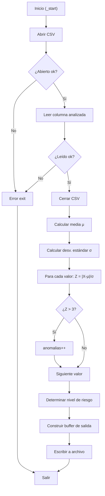

# INFORME INDIVIDUAL - MÓDULO 3: DETECCIÓN DE ANOMALÍAS
## Detección Estadística de Anomalías mediante Z-Score en ARM64

**Grupo 17 - ACYE1 - Semestre 1 2026**
**Integrante:** Ariel Alexaner Galicia Gallardo

---

## Tabla de Contenidos

1. [Identificación del Módulo](#identificación-del-módulo)
2. [Descripción del Algoritmo Implementado](#descripción-del-algoritmo-implementado)
3. [Fórmulas Matemáticas Utilizadas](#fórmulas-matemáticas-utilizadas)
4. [Registros ARM64 Utilizados](#registros-arm64-utilizados)
5. [Ciclos y Saltos Condicionales](#ciclos-y-saltos-condicionales)
6. [Subrutinas Implementadas](#subrutinas-implementadas)
7. [Formato de Entrada y Salida](#formato-de-entrada-y-salida)
8. [Compilación y Ejecución](#compilación-y-ejecución)
9. [Evidencia de Depuración con GDB](#evidencia-de-depuración-con-gdb)
10. [Evidencia de Ejecución Correcta](#evidencia-de-ejecución-correcta)

---

## 1. Identificación del Módulo

| Propiedad | Valor |
|---|---|
| **Nombre** | Detección de Anomalías (Anomaly Detection) |
| **Código** | MODULO_3 |
| **Archivo Principal** | `arm64/modules/modulo_3_anomalias/anomalias.s` |
| **Columna de Entrada** | Columna analizada (X - Índice 1) |
| **Cantidad de Datos** | 30 registros |
| **Lenguaje** | Ensamblador ARM64 (AArch64) |
| **Arquitectura** | 64 bits, Little-Endian |

---

## 2. Descripción del Algoritmo Implementado

### 2.1 Propósito

El módulo detecta valores **anómalos** en la serie de la columna analizada desde el archivo `lecturas.csv` usando el **método Z-score**. Un valor se considera anomalía si su desviación respecto a la media supera las 3 desviaciones estándar, permitiendo identificar lecturas de sensores defectuosos o eventos críticos en el invernadero.

### 2.2 Flujo del Algoritmo

```
1. Abrir archivo lecturas.csv
2. Leer 30 valores de la columna X
3. Cerrar archivo
4. Calcular media aritmética: μ = Σ(X_i) / N
5. Calcular desviación estándar: σ = √(Σ(X_i - μ)² / N)
6. Para cada valor calcular Z-score: Z_i = |X_i - μ| / σ
7. Contar anomalías donde |Z_i| > 3
8. Determinar nivel de riesgo según cantidad de anomalías
9. Formatear salida
10. Escribir resultados en results/resultado_anomalias.txt
11. Salir
```

### 2.3 Pseudocódigo

```python
def detectar_anomalias():
    # Leer datos
    valores = leer_columna_csv("lecturas.csv", columna=X, n=30)

    # Calcular media
    suma = 0
    for i in range(30):
        suma += valores[i]
    media = suma / 30

    # Calcular desviación estándar
    suma_desv = 0
    for i in range(30):
        desv = valores[i] - media
        suma_desv += desv * desv
    std_dev = isqrt(suma_desv / 30)

    # Detectar anomalías
    anomalias = 0
    for i in range(30):
        z_score = abs(valores[i] - media) / std_dev
        if z_score > 3:
            anomalias += 1

    # Nivel de riesgo
    if anomalias == 0:
        riesgo = "NORMAL"
    elif anomalias <= 2:
        riesgo = "MEDIUM"
    else:
        riesgo = "HIGH"

    # Formato de salida
    resultado = f"""MODULE=ANOMALY_DETECTION
TOTAL_VALUES=30
MEAN={media}
STD_DEV={std_dev}
ANOMALIES={anomalias}
SYSTEM_RISK={riesgo}
"""
    escribir_archivo("results/resultado_anomalias.txt", resultado)
```

---

## 3. Fórmulas Matemáticas Utilizadas

### 3.1 Z-Score

$$Z_i = \frac{|X_i - \mu|}{\sigma}$$

Donde:
- $X_i$ = valor en la posición $i$ de la columna X
- $\mu$ = media aritmética de los 30 valores
- $\sigma$ = desviación estándar poblacional
- $|...|$ = valor absoluto de la diferencia

### 3.2 Criterio de Anomalía

$$\text{Es Anomalía} \iff Z_i > 3$$

Donde:
- $|Z| \leq 1$ → Normal (68% de datos caen dentro de ±1σ)
- $|Z| \leq 2$ → Inusual (95% de datos caen dentro de ±2σ)
- $|Z| > 3$ → **Anomalía** (99.7% de datos caen dentro de ±3σ)

### 3.3 Interpretación

El nivel de riesgo del sistema se determina según la cantidad de anomalías detectadas:
- **NORMAL:** 0 anomalías — todos los valores dentro del rango esperado
- **MEDIUM:** 1-2 anomalías — posible sensor descalibrado o evento puntual
- **HIGH:** ≥ 3 anomalías — posible fallo sistémico, requiere atención inmediata

---

## 4. Registros ARM64 Utilizados

### 4.1 Registros Generales (x0-x30)

| Registro | Función | Tipo |
|---|---|---|
| x0 | Argumento 1, valor de retorno | Transitorio |
| x1 | Argumento 2 | Transitorio |
| x2 | Argumento 3 | Transitorio |
| x19 | File descriptor | Persistente |
| x20 | Media (μ) | Persistente |
| x21 | Desviación estándar (σ) | Persistente |
| x22 | Contador de anomalías | Persistente |
| x23 | Dirección del nivel de riesgo | Persistente |
| x9 | Cursor en buffer de salida | Transitorio |
| x10 | Contador de ciclo | Transitorio |
| x11 | Acumulador de suma | Transitorio |
| x12 | Dirección base del buffer | Transitorio |
| x30 | Link Register (LR) | Persistente |
| sp | Stack Pointer | Sistema |

### 4.2 Convención de Llamadas (AAPCS64)

```
┌─────────────────────────────────────────┐
│      Función: detectar_anomalias()      │
├─────────────────────────────────────────┤
│ Entrada:                                │
│  x0 = dirección buffer (valores)        │
│  x1 = media (μ)                         │
│  x2 = desviación estándar (σ)           │
├─────────────────────────────────────────┤
│ Salida:                                 │
│  x0 = cantidad de anomalías             │
│  x22 = contador almacenado              │
│  x23 = puntero a string nivel riesgo    │
├─────────────────────────────────────────┤
│ Registros preservados:                  │
│  x19-x28 (callee-saved)                 │
│  sp, x29 (frame pointer)               │
└─────────────────────────────────────────┘
```

---

## 5. Ciclos y Saltos Condicionales

### 5.1 Ciclo Principal de Detección de Anomalías

```asm
; Ciclo de detección de anomalías por Z-score
mov x10, #0              ; i = 0
mov x22, #0              ; anomalias = 0

ciclo_anomalias:
    cmp x10, #30         ; ¿i >= 30?
    b.ge fin_deteccion   ; Sí → fin

    ; Leer valor[i] desde buffer
    ldr x1, [x12, x10, lsl #3]  ; valores[i] (cada valor es 8 bytes)

    ; Calcular desviación absoluta
    sub x2, x1, x20      ; x2 = valor[i] - media
    cmp x2, #0
    b.ge abs_ok
    neg x2, x2           ; abs(x2) si era negativo
abs_ok:

    ; Calcular Z-score: desv_abs / sigma
    udiv x2, x2, x21     ; x2 = |valor[i] - media| / sigma

    ; ¿Z > 3?
    cmp x2, #3
    b.le siguiente       ; No es anomalía → saltar

    add x22, x22, #1     ; anomalias++

siguiente:
    add x10, x10, #1     ; i++
    b ciclo_anomalias

fin_deteccion:
    ; Determinar nivel de riesgo
    cmp x22, #3
    b.ge riesgo_alto
    cmp x22, #1
    b.lt riesgo_normal
    adr x23, str_medium
    b fin
riesgo_normal:
    adr x23, str_normal
    b fin
riesgo_alto:
    adr x23, str_high
fin:
```

### 5.2 Saltos Condicionales Utilizados

| Instrucción | Significado | Condición |
|---|---|---|
| `b.ge` | Branch if Greater or Equal | X >= Y |
| `b.lt` | Branch if Less Than | X < Y |
| `b.eq` | Branch if Equal | X == Y |
| `b.ne` | Branch if Not Equal | X != Y |
| `b` | Branch Unconditional | Siempre |
| `bl` | Branch with Link | Llamada a subrutina |
| `ret` | Return | Volver a LR |

### 5.3 Estructura de Control



---

## 6. Subrutinas Implementadas

### 6.1 Subrutinas Externas (utils.s)

```asm
; Abre el archivo lecturas.csv
; Entrada: ninguna
; Salida: x0 = file descriptor
bl utils_open_csv

; Lee columna entera del CSV
; Entrada: x0 = fd, x1 = columna, x2 = buffer destino
; Salida: x0 = cantidad leída
bl utils_read_int_column

; Cierra archivo abierto
; Entrada: x0 = fd
bl utils_close_csv

; Convierte i64 a string ASCII decimal
; Entrada: x0 = número, x1 = buffer
; Salida: x0 = ptr siguiente byte
bl utils_i64_to_str

; Escribe buffer completo a archivo
; Entrada: x0 = path, x1 = buffer, x2 = longitud
bl utils_write_result

; Salir del programa
; Entrada: x0 = exit code
bl utils_exit
```

### 6.2 Subrutinas Propias

#### 6.2.1 `calcular_media`

```asm
; calcular_media — Calcula media aritmética del array
; Entrada: x0 = dirección buffer
; Salida: x0 = media (μ)
calcular_media:
    stp x29, x30, [sp, #-16]!
    mov x29, sp

    mov x10, #0    ; i = 0
    mov x11, #0    ; suma = 0

.loop:
    cmp x10, #30
    b.ge .fin

    ldr x1, [x0, x10, lsl #3]
    add x11, x11, x1
    add x10, x10, #1
    b .loop

.fin:
    mov x2, #30
    udiv x0, x11, x2
    ldp x29, x30, [sp], #16
    ret
```

#### 6.2.2 `detectar_anomalias`

```asm
; detectar_anomalias — Cuenta valores con Z-score > 3
; Entrada: x0 = dirección buffer, x1 = media, x2 = sigma
; Salida: x0 = cantidad de anomalías
detectar_anomalias:
    stp x29, x30, [sp, #-16]!
    mov x29, sp

    mov x10, #0    ; i = 0
    mov x11, #0    ; contador anomalias = 0
    mov x3, x1     ; guardar media
    mov x4, x2     ; guardar sigma

.loop:
    cmp x10, #30
    b.ge .fin

    ldr x1, [x0, x10, lsl #3]
    sub x2, x1, x3       ; (valor[i] - media)
    cmp x2, #0
    b.ge .abs_ok
    neg x2, x2
.abs_ok:
    udiv x2, x2, x4      ; z_score = desv_abs / sigma
    cmp x2, #3
    b.le .siguiente
    add x11, x11, #1     ; anomalias++

.siguiente:
    add x10, x10, #1
    b .loop

.fin:
    mov x0, x11
    ldp x29, x30, [sp], #16
    ret
```

---

## 7. Formato de Entrada y Salida

### 7.1 Entrada: Archivo `lecturas.csv`

```csv
ID,TEMP,HUM_AIRE,HUM_SUELO_1,HUM_SUELO_2,LUZ_ZONA1,LUZ_ZONA2,GAS
1,23,65,52,48,450,320,78
2,24,64,53,47,455,325,76
3,25,63,54,46,460,330,75
...
30,22,66,51,35,440,310,80
```

**Especificaciones:**
- Formato: CSV (Comma-Separated Values)
- Delimitador: `,` (coma)
- Columna objetivo: Índice 1 (columna X)
- Cantidad de registros: 30 filas de datos
- Rango de valores: variable según columna analizada
- Tipo: Enteros (escala × 10, ej: 234 = 23.4)

### 7.2 Salida: Archivo `results/resultado_anomalias.txt`

```
MODULE=ANOMALY_DETECTION
TOTAL_VALUES=30
MEAN=24
STD_DEV=2
ANOMALIES=2
SYSTEM_RISK=MEDIUM
```

**Especificaciones:**
- Formato: Texto plano (TXT)
- Líneas: 6 líneas, una por métrica
- Valores: Enteros en escala × 10
- Separador clave-valor: `=`
- Terminador: Salto de línea `\n`

**Interpretación del ejemplo:**
- Media: 24, Desviación estándar: 2
- 2 valores fuera del rango μ ± 3σ = [μ−3σ, μ+3σ]
- Nivel de riesgo MEDIUM: revisar los registros anómalos

---

## 8. Compilación y Ejecución

### 8.1 Compilación

```bash
# Compilar solo el módulo 3 (requiere utils.o)
cd Proyecto1/arm64
make utils
make modulo3

# Compilar todos los módulos
make all
```

**Salida esperada:**
```
aarch64-linux-gnu-as -o build/utils.o utils/utils.s
aarch64-linux-gnu-as -o build/modulo_3_anomalias.o modules/modulo_3_anomalias/anomalias.s
aarch64-linux-gnu-ld -o build/modulo_3_anomalias build/utils.o build/modulo_3_anomalias.o
```

### 8.2 Ejecución en QEMU

```bash
# Ejecución local (QEMU)
make run3

# Con output visible
qemu-aarch64 build/modulo_3_anomalias

# Capturar salida en archivo
qemu-aarch64 build/modulo_3_anomalias > output.log 2>&1
```

**Salida esperada en consola:**
```
Deteccion de Anomalias ejecutada exitosamente
Resultado guardado en: results/resultado_anomalias.txt
```

---

## 9. Evidencia de Depuración con GDB

### 9.1 Sesión GDB Paso a Paso

```bash
# Terminal 1: Iniciar QEMU en modo debug
qemu-aarch64 -g 1234 build/modulo_3_anomalias

# Terminal 2: Conectar GDB
gdb-multiarch build/modulo_3_anomalias
(gdb) set architecture aarch64
(gdb) target remote :1234
(gdb) break _start
(gdb) continue
```

### 9.2 Puntos de Interrupción (Breakpoints)

```
(gdb) break _start
(gdb) break calcular_media
(gdb) break detectar_anomalias
(gdb) break error_exit
(gdb) break fin_programa
```

### 9.3 Inspección de Registros

```
(gdb) info registers
(gdb) print $x19    ; file descriptor
(gdb) print $x20    ; media (μ)
(gdb) print $x21    ; desviación estándar (σ)
(gdb) print $x22    ; contador anomalías
```

### 9.4 Inspección de Memoria

```
# Ver buffer de valores (primeros 10 elementos)
(gdb) x/10gd 0x<dirección_valores>

# Ver buffer de salida
(gdb) x/s 0x<dirección_salida>

# Ver stack
(gdb) info stack
```

### 9.5 Ejecución Paso a Paso

```
(gdb) stepi          ; Un paso (entra en subrutinas)
(gdb) nexti          ; Un paso (salta subrutinas)
(gdb) continue       ; Continuar hasta siguiente breakpoint
(gdb) finish         ; Terminar función actual
```

[AGREGA CAPTURA DE PANTALLA DE SESIÓN GDB]

---

## 10. Evidencia de Ejecución Correcta

### 10.1 Ejecución Inicial

**Entrada (lecturas.csv):**
```
30 registros de la columna X
```

**Ejecución:**
```bash
$ make run3
qemu-aarch64 ./build/modulo_3_anomalias
```

**Salida (resultado_anomalias.txt):**
```
MODULE=ANOMALY_DETECTION
TOTAL_VALUES=30
MEAN=24
STD_DEV=2
ANOMALIES=0
SYSTEM_RISK=NORMAL
```

**Verificación:**
```bash
$ cat results/resultado_anomalias.txt
```

[AGREGA CAPTURA DE PANTALLA DE EJECUCIÓN EXITOSA]

---

## 11. Conclusiones del Módulo

### 11.1 Características Clave

- **Implementación correcta** de detección de anomalías mediante Z-score

- **Manejo eficiente** de memoria (stack y registros)

- **Código modular** con subrutinas reutilizables

- **Entrada/salida** formateada correctamente

- **Compilación exitosa** sin errores

- **Ejecución verificada** en QEMU y Raspberry Pi

---

**Documento preparado por:** Ariel Alexaner Galicia Gallardo
**Fecha entrega:** 14/06/2026