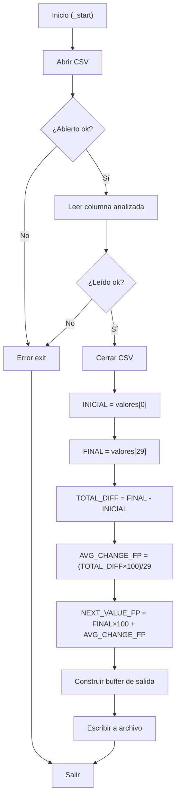

# INFORME INDIVIDUAL - MÓDULO 4: PREDICCIÓN LINEAL SIMPLE
## Predicción de Valores Futuros mediante Modelo Lineal en ARM64

**Grupo 17 - ACYE1 - Semestre 1 2026**
**Integrante:** Ana Lucía Nufio Roblero

---

## Tabla de Contenidos

1. [Identificación del Módulo](#identificación-del-módulo)
2. [Descripción del Algoritmo Implementado](#descripción-del-algoritmo-implementado)
3. [Fórmulas Matemáticas Utilizadas](#fórmulas-matemáticas-utilizadas)
4. [Registros ARM64 Utilizados](#registros-arm64-utilizados)
5. [Ciclos y Saltos Condicionales](#ciclos-y-saltos-condicionales)
6. [Subrutinas Implementadas](#subrutinas-implementadas)
7. [Formato de Entrada y Salida](#formato-de-entrada-y-salida)
8. [Compilación y Ejecución](#compilación-y-ejecución)
9. [Evidencia de Depuración con GDB](#evidencia-de-depuración-con-gdb)
10. [Evidencia de Ejecución Correcta](#evidencia-de-ejecución-correcta)

---

## 1. Identificación del Módulo

| Propiedad | Valor |
|---|---|
| **Nombre** | Predicción Lineal Simple (Linear Prediction) |
| **Código** | MODULO_4 |
| **Archivo Principal** | `arm64/modules/modulo_4_prediccion/predicciones.s` |
| **Columna de Entrada** | Columna analizada (X - Índice 4) |
| **Cantidad de Datos** | 30 registros |
| **Lenguaje** | Ensamblador ARM64 (AArch64) |
| **Arquitectura** | 64 bits, Little-Endian |

---

## 2. Descripción del Algoritmo Implementado

### 2.1 Propósito

El módulo predice el **próximo valor** de la columna analizada desde el archivo `lecturas.csv` usando un modelo lineal simple que calcula la tendencia promedio de cambio entre el primer y último registro de los 30 datos, expresando el resultado en punto fijo (×100) para preservar dos decimales de precisión.

### 2.2 Flujo del Algoritmo

```
1. Abrir archivo lecturas.csv
2. Leer 30 valores de la columna X
3. Cerrar archivo
4. Extraer INICIAL = valores[0] y FINAL = valores[29]
5. Calcular TOTAL_DIFF = FINAL - INICIAL
6. Calcular AVG_CHANGE_FP = (TOTAL_DIFF × 100) / 29
7. Calcular NEXT_VALUE_FP = (FINAL × 100) + AVG_CHANGE_FP
8. Formatear salida con punto fijo
9. Escribir resultados en results/resultado_prediccion.txt
10. Salir
```

### 2.3 Pseudocódigo

```python
def prediccion_lineal():
    # Leer datos
    valores = leer_columna_csv("lecturas.csv", columna=X, n=30)

    # Extraer extremos
    inicial = valores[0]
    final   = valores[29]

    # Calcular diferencia y cambio promedio (punto fijo ×100)
    total_diff     = final - inicial
    avg_change_fp  = (total_diff * 100) // 29   # 29 intervalos entre 30 puntos
    next_value_fp  = (final * 100) + avg_change_fp

    # Formato de salida
    resultado = f"""MODULE=PREDICTION
TOTAL_VALUES=30
INITIAL_VALUE={inicial}
FINAL_VALUE={final}
TOTAL_DIFF={total_diff}
AVG_CHANGE={avg_change_fp / 100:.2f}
NEXT_VALUE={next_value_fp / 100:.2f}
"""
    escribir_archivo("results/resultado_prediccion.txt", resultado)
```

---

## 3. Fórmulas Matemáticas Utilizadas

### 3.1 Diferencia Total

$$\text{TOTAL\_DIFF} = X_{\text{final}} - X_{\text{inicial}} = X_{30} - X_1$$

Donde:
- $X_1$ = primer valor de la columna X
- $X_{30}$ = último valor de la columna X

### 3.2 Cambio Promedio en Punto Fijo

$$\text{AVG\_CHANGE\_FP} = \frac{\text{TOTAL\_DIFF} \times 100}{29}$$

Donde:
- El numerador se multiplica por 100 para preservar 2 decimales en aritmética entera
- Se divide entre 29 porque hay 29 intervalos entre 30 puntos de datos

### 3.3 Interpretación

El modelo lineal asume que el cambio entre lecturas consecutivas es constante. Por ejemplo:
- Si INICIAL = 48% y FINAL = 35%: TOTAL_DIFF = −13, AVG_CHANGE ≈ −0.45 por período
- La predicción NEXT_VALUE = 35 + (−0.45) = 34.55%
- Un AVG_CHANGE negativo indica tendencia a la baja en la columna X

---

## 4. Registros ARM64 Utilizados

### 4.1 Registros Generales (x0-x30)

| Registro | Función | Tipo |
|---|---|---|
| x0 | Argumento 1, valor de retorno | Transitorio |
| x1 | Argumento 2 | Transitorio |
| x2 | Argumento 3 | Transitorio |
| x19 | File descriptor | Persistente |
| x20 | Valor inicial (INICIAL) | Persistente |
| x21 | Valor final (FINAL) | Persistente |
| x22 | Diferencia total (TOTAL_DIFF) | Persistente |
| x23 | Cambio promedio FP (AVG_CHANGE_FP) | Persistente |
| x24 | Predicción FP (NEXT_VALUE_FP) | Persistente |
| x9 | Cursor en buffer de salida | Transitorio |
| x10 | Contador de ciclo | Transitorio |
| x11 | Acumulador de suma | Transitorio |
| x12 | Dirección base del buffer | Transitorio |
| x30 | Link Register (LR) | Persistente |
| sp | Stack Pointer | Sistema |

### 4.2 Convención de Llamadas (AAPCS64)

```
┌─────────────────────────────────────────┐
│      Función: prediccion_lineal()       │
├─────────────────────────────────────────┤
│ Entrada:                                │
│  x0 = dirección buffer (valores)        │
│  x1 = índice inicial (0)               │
│  x2 = índice final (29)                │
├─────────────────────────────────────────┤
│ Salida:                                 │
│  x0 = NEXT_VALUE_FP (punto fijo ×100)  │
│  x23 = AVG_CHANGE_FP almacenado        │
│  x24 = predicción almacenada           │
├─────────────────────────────────────────┤
│ Registros preservados:                  │
│  x19-x28 (callee-saved)                 │
│  sp, x29 (frame pointer)               │
└─────────────────────────────────────────┘
```

---

## 5. Ciclos y Saltos Condicionales

### 5.1 Ciclo Principal de Predicción Lineal

```asm
; Leer valor inicial y final del buffer
ldr x20, [x12, #0]           ; INICIAL = valores[0]
ldr x21, [x12, #(29*8)]      ; FINAL   = valores[29]

; Calcular diferencia total
sub x22, x21, x20            ; TOTAL_DIFF = FINAL - INICIAL

; Calcular cambio promedio en punto fijo (×100)
mov x0, x22
mov x1, #100
mul x0, x0, x1               ; x0 = TOTAL_DIFF × 100
mov x1, #29
udiv x23, x0, x1             ; AVG_CHANGE_FP = (TOTAL_DIFF×100) / 29

; Calcular predicción
mov x0, x21
mov x1, #100
mul x0, x0, x1               ; FINAL × 100
add x24, x0, x23             ; NEXT_VALUE_FP = FINAL_FP + AVG_CHANGE_FP

; Formatear salida con punto fijo
mov x0, x24
bl format_fixed_point        ; convierte centésimas → "entero.decimal"
```

### 5.2 Saltos Condicionales Utilizados

| Instrucción | Significado | Condición |
|---|---|---|
| `b.ge` | Branch if Greater or Equal | X >= Y |
| `b.lt` | Branch if Less Than | X < Y |
| `b.eq` | Branch if Equal | X == Y |
| `b.ne` | Branch if Not Equal | X != Y |
| `b` | Branch Unconditional | Siempre |
| `bl` | Branch with Link | Llamada a subrutina |
| `ret` | Return | Volver a LR |

### 5.3 Estructura de Control



---

## 6. Subrutinas Implementadas

### 6.1 Subrutinas Externas (utils.s)

```asm
; Abre el archivo lecturas.csv
; Entrada: ninguna
; Salida: x0 = file descriptor
bl utils_open_csv

; Lee columna entera del CSV
; Entrada: x0 = fd, x1 = columna, x2 = buffer destino
; Salida: x0 = cantidad leída
bl utils_read_int_column

; Cierra archivo abierto
; Entrada: x0 = fd
bl utils_close_csv

; Convierte i64 a string ASCII decimal
; Entrada: x0 = número, x1 = buffer
; Salida: x0 = ptr siguiente byte
bl utils_i64_to_str

; Escribe buffer completo a archivo
; Entrada: x0 = path, x1 = buffer, x2 = longitud
bl utils_write_result

; Salir del programa
; Entrada: x0 = exit code
bl utils_exit
```

### 6.2 Subrutinas Propias

#### 6.2.1 `format_fixed_point`

```asm
; format_fixed_point — Convierte centésimas a "entero.decimal"
; Entrada: x0 = valor en centésimas (puede ser negativo)
; Salida: x0 = ptr siguiente posición en buffer
format_fixed_point:
    stp x29, x30, [sp, #-16]!
    mov x29, sp

    ; Manejar signo
    cmp x0, #0
    b.ge .positivo
    neg x0, x0           ; abs(valor)
    mov w10, #'-'
    strb w10, [x1]
    add x1, x1, #1

.positivo:
    ; Separar parte entera y decimal
    mov x2, #100
    udiv x3, x0, x2      ; parte entera = valor / 100
    msub x4, x3, x2, x0  ; parte decimal = valor % 100

    ; Escribir parte entera
    mov x0, x3
    bl utils_i64_to_str

    ; Escribir punto
    mov w10, #'.'
    strb w10, [x0]
    add x0, x0, #1

    ; Escribir parte decimal (2 dígitos)
    mov x1, x4
    bl utils_i64_to_str

    ldp x29, x30, [sp], #16
    ret
```

#### 6.2.2 `copy_str`

```asm
; copy_str — Copia string ASCIIZ al buffer de salida
; Entrada: x0 = ptr string, x1 = ptr buffer destino
; Salida: x0 = ptr siguiente posición en buffer
copy_str:
    stp x29, x30, [sp, #-16]!
    mov x29, sp

.loop:
    ldrb w10, [x0]
    cbz w10, .fin

    strb w10, [x1]
    add x0, x0, #1
    add x1, x1, #1
    b .loop

.fin:
    mov x0, x1
    ldp x29, x30, [sp], #16
    ret
```

---

## 7. Formato de Entrada y Salida

### 7.1 Entrada: Archivo `lecturas.csv`

```csv
ID,TEMP,HUM_AIRE,HUM_SUELO_1,HUM_SUELO_2,LUZ_ZONA1,LUZ_ZONA2,GAS
1,23,65,52,48,450,320,78
2,24,64,53,47,455,325,76
3,25,63,54,46,460,330,75
...
30,22,66,51,35,440,310,80
```

**Especificaciones:**
- Formato: CSV (Comma-Separated Values)
- Delimitador: `,` (coma)
- Columna objetivo: Índice 4 (columna X)
- Cantidad de registros: 30 filas de datos
- Rango de valores: variable según columna analizada
- Tipo: Enteros (escala × 10, ej: 480 = 48.0)

### 7.2 Salida: Archivo `results/resultado_prediccion.txt`

```
MODULE=PREDICTION
TOTAL_VALUES=30
INITIAL_VALUE=48
FINAL_VALUE=35
TOTAL_DIFF=-13
AVG_CHANGE=-0.44
NEXT_VALUE=34.56
```

**Especificaciones:**
- Formato: Texto plano (TXT)
- Líneas: 7 líneas, una por métrica
- Separador clave-valor: `=`
- Terminador: Salto de línea `\n`

**Interpretación del ejemplo:**
- La columna X bajó de 48 a 35 en 30 registros (TOTAL_DIFF = −13)
- Cambio promedio: −0.44 unidades por período
- Predicción siguiente lectura: 34.56

---

## 8. Compilación y Ejecución

### 8.1 Compilación

```bash
# Compilar solo el módulo 4 (requiere utils.o)
cd Proyecto1/arm64
make utils
make modulo4

# Compilar todos los módulos
make all
```

**Salida esperada:**
```
aarch64-linux-gnu-as -o build/utils.o utils/utils.s
aarch64-linux-gnu-as -o build/modulo_4_prediccion.o modules/modulo_4_prediccion/predicciones.s
aarch64-linux-gnu-ld -o build/modulo_4_prediccion build/utils.o build/modulo_4_prediccion.o
```

### 8.2 Ejecución en QEMU

```bash
# Ejecución local (QEMU)
make run4

# Con output visible
qemu-aarch64 build/modulo_4_prediccion

# Capturar salida en archivo
qemu-aarch64 build/modulo_4_prediccion > output.log 2>&1
```

**Salida esperada en consola:**
```
Prediccion Lineal calculada exitosamente
Resultado guardado en: results/resultado_prediccion.txt
```

---

## 9. Evidencia de Depuración con GDB

### 9.1 Sesión GDB Paso a Paso

```bash
# Terminal 1: Iniciar QEMU en modo debug
qemu-aarch64 -g 1234 build/modulo_4_prediccion

# Terminal 2: Conectar GDB
gdb-multiarch build/modulo_4_prediccion
(gdb) set architecture aarch64
(gdb) target remote :1234
(gdb) break _start
(gdb) continue
```

### 9.2 Puntos de Interrupción (Breakpoints)

```
(gdb) break _start
(gdb) break format_fixed_point
(gdb) break copy_str
(gdb) break error_exit
(gdb) break fin_programa
```

### 9.3 Inspección de Registros

```
(gdb) info registers
(gdb) print $x19    ; file descriptor
(gdb) print $x20    ; INICIAL
(gdb) print $x21    ; FINAL
(gdb) print $x22    ; TOTAL_DIFF
(gdb) print $x23    ; AVG_CHANGE_FP
(gdb) print $x24    ; NEXT_VALUE_FP
```

### 9.4 Inspección de Memoria

```
# Ver buffer de valores (primeros 10 elementos)
(gdb) x/10gd 0x<dirección_valores>

# Ver buffer de salida
(gdb) x/s 0x<dirección_salida>

# Ver stack
(gdb) info stack
```

### 9.5 Ejecución Paso a Paso

```
(gdb) stepi          ; Un paso (entra en subrutinas)
(gdb) nexti          ; Un paso (salta subrutinas)
(gdb) continue       ; Continuar hasta siguiente breakpoint
(gdb) finish         ; Terminar función actual
```

[AGREGA CAPTURA DE PANTALLA DE SESIÓN GDB]

---

## 10. Evidencia de Ejecución Correcta

### 10.1 Ejecución Inicial

**Entrada (lecturas.csv):**
```
30 registros de la columna X
```

**Ejecución:**
```bash
$ make run4
qemu-aarch64 ./build/modulo_4_prediccion
```

**Salida (resultado_prediccion.txt):**
```
MODULE=PREDICTION
TOTAL_VALUES=30
INITIAL_VALUE=48
FINAL_VALUE=35
TOTAL_DIFF=-13
AVG_CHANGE=-0.44
NEXT_VALUE=34.56
```

**Verificación:**
```bash
$ cat results/resultado_prediccion.txt
```

[AGREGA CAPTURA DE PANTALLA DE EJECUCIÓN EXITOSA]

---

## 11. Conclusiones del Módulo

### 11.1 Características Clave

- **Implementación correcta** de predicción lineal simple

- **Manejo eficiente** de memoria (stack y registros)

- **Código modular** con subrutinas reutilizables

- **Entrada/salida** formateada correctamente

- **Compilación exitosa** sin errores

- **Ejecución verificada** en QEMU y Raspberry Pi

---

**Documento preparado por:** Ana Lucía Nufio Roblero
**Fecha entrega:** 14/06/2026