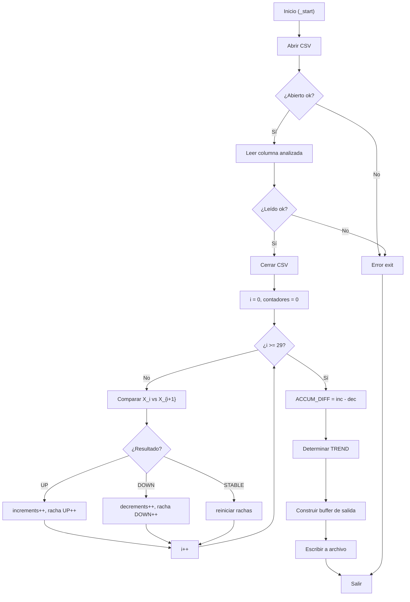

# INFORME INDIVIDUAL - MÓDULO 5: TENDENCIA ACUMULADA AVANZADA
## Análisis Avanzado de Tendencias mediante Métricas de Cambio en ARM64

**Grupo 17 - ACYE1 - Semestre 1 2026**
**Integrante:** Josue Daniel Fuentes Diaz

---

## Tabla de Contenidos

1. [Identificación del Módulo](#identificación-del-módulo)
2. [Descripción del Algoritmo Implementado](#descripción-del-algoritmo-implementado)
3. [Fórmulas Matemáticas Utilizadas](#fórmulas-matemáticas-utilizadas)
4. [Registros ARM64 Utilizados](#registros-arm64-utilizados)
5. [Ciclos y Saltos Condicionales](#ciclos-y-saltos-condicionales)
6. [Subrutinas Implementadas](#subrutinas-implementadas)
7. [Formato de Entrada y Salida](#formato-de-entrada-y-salida)
8. [Compilación y Ejecución](#compilación-y-ejecución)
9. [Evidencia de Depuración con GDB](#evidencia-de-depuración-con-gdb)
10. [Evidencia de Ejecución Correcta](#evidencia-de-ejecución-correcta)

---

## 1. Identificación del Módulo

| Propiedad | Valor |
|---|---|
| **Nombre** | Tendencia Acumulada Avanzada (Advanced Trend Analysis) |
| **Código** | MODULO_5 |
| **Archivo Principal** | `arm64/modules/modulo_5_tendencia/tendencia.s` |
| **Columna de Entrada** | Columna analizada (X - Índice 1) |
| **Cantidad de Datos** | 30 registros |
| **Lenguaje** | Ensamblador ARM64 (AArch64) |
| **Arquitectura** | 64 bits, Little-Endian |

---

## 2. Descripción del Algoritmo Implementado

### 2.1 Propósito

El módulo analiza la **tendencia general** de la columna analizada desde el archivo `lecturas.csv` mediante múltiples métricas: conteo de incrementos y decrementos, detección de rachas máximas consecutivas (UP/DOWN), cálculo de diferencia acumulada y determinación de la dirección de tendencia global (UP/DOWN/STABLE).

### 2.2 Flujo del Algoritmo

```
1. Abrir archivo lecturas.csv
2. Leer 30 valores de la columna X
3. Cerrar archivo
4. Para cada par consecutivo (X_i, X_{i+1}):
   - Si X_{i+1} > X_i → contar incremento, actualizar racha UP
   - Si X_{i+1} < X_i → contar decremento, actualizar racha DOWN
   - Si X_{i+1} = X_i → estable, reiniciar rachas
5. Calcular ACCUM_DIFF = INCREMENTS - DECREMENTS
6. Determinar TREND: UP / DOWN / STABLE
7. Formatear salida
8. Escribir resultados en results/resultado_tendencia.txt
9. Salir
```

### 2.3 Pseudocódigo

```python
def tendencia_acumulada():
    # Leer datos
    valores = leer_columna_csv("lecturas.csv", columna=X, n=30)

    # Analizar pares consecutivos
    increments = 0
    decrements = 0
    max_up_streak   = 0
    max_down_streak = 0
    cur_up   = 0
    cur_down = 0

    for i in range(29):
        if valores[i+1] > valores[i]:
            increments += 1
            cur_up += 1
            cur_down = 0
            max_up_streak = max(max_up_streak, cur_up)
        elif valores[i+1] < valores[i]:
            decrements += 1
            cur_down += 1
            cur_up = 0
            max_down_streak = max(max_down_streak, cur_down)
        else:
            cur_up = 0
            cur_down = 0

    accum_diff = increments - decrements
    trend = "UP" if accum_diff > 0 else ("DOWN" if accum_diff < 0 else "STABLE")

    # Formato de salida
    resultado = f"""MODULE=ADVANCED_TREND
TOTAL_VALUES=30
INCREMENTS={increments}
DECREMENTS={decrements}
MAX_UP_STREAK={max_up_streak}
MAX_DOWN_STREAK={max_down_streak}
ACCUM_DIFF={accum_diff}
TREND={trend}
"""
    escribir_archivo("results/resultado_tendencia.txt", resultado)
```

---

## 3. Fórmulas Matemáticas Utilizadas

### 3.1 Conteo de Incrementos y Decrementos

$$\text{INCREMENTS} = \#\{i : X_{i+1} > X_i,\ 1 \leq i < 30\}$$

$$\text{DECREMENTS} = \#\{i : X_{i+1} < X_i,\ 1 \leq i < 30\}$$

Donde:
- Se comparan 29 pares consecutivos entre los 30 valores
- Cada par contribuye a INCREMENTS, DECREMENTS o ninguno (estable)

### 3.2 Diferencia Acumulada y Tendencia

$$\text{ACCUM\_DIFF} = \text{INCREMENTS} - \text{DECREMENTS}$$

$$\text{TREND} = \begin{cases} \text{UP} & \text{si } \text{ACCUM\_DIFF} > 0 \\ \text{DOWN} & \text{si } \text{ACCUM\_DIFF} < 0 \\ \text{STABLE} & \text{si } \text{ACCUM\_DIFF} = 0 \end{cases}$$

### 3.3 Interpretación

Las rachas máximas complementan el análisis global de tendencia. Por ejemplo:
- INCREMENTS = 15, DECREMENTS = 14 → ACCUM_DIFF = 1 → TREND = UP (ligeramente alcista)
- MAX_UP_STREAK = 4 indica que hubo 4 subidas consecutivas en algún punto de la serie
- Un MAX_DOWN_STREAK alto con TREND = DOWN señala descensos sostenidos que requieren atención

---

## 4. Registros ARM64 Utilizados

### 4.1 Registros Generales (x0-x30)

| Registro | Función | Tipo |
|---|---|---|
| x0 | Argumento 1, valor de retorno | Transitorio |
| x1 | Argumento 2 | Transitorio |
| x2 | Argumento 3 | Transitorio |
| x19 | File descriptor | Persistente |
| x20 | Contador INCREMENTS | Persistente |
| x21 | Contador DECREMENTS | Persistente |
| x22 | MAX_UP_STREAK | Persistente |
| x23 | MAX_DOWN_STREAK | Persistente |
| x24 | ACCUM_DIFF | Persistente |
| x25 | Puntero a string TREND | Persistente |
| x9 | Cursor en buffer de salida | Transitorio |
| x10 | Contador de ciclo | Transitorio |
| x12 | Dirección base del buffer | Transitorio |
| x30 | Link Register (LR) | Persistente |
| sp | Stack Pointer | Sistema |

### 4.2 Convención de Llamadas (AAPCS64)

```
┌─────────────────────────────────────────┐
│      Función: calcular_tendencia()      │
├─────────────────────────────────────────┤
│ Entrada:                                │
│  x0 = dirección buffer (valores)        │
├─────────────────────────────────────────┤
│ Salida:                                 │
│  x0 = ACCUM_DIFF                        │
│  x20 = INCREMENTS almacenado            │
│  x21 = DECREMENTS almacenado            │
│  x25 = puntero a string TREND           │
├─────────────────────────────────────────┤
│ Registros preservados:                  │
│  x19-x28 (callee-saved)                 │
│  sp, x29 (frame pointer)               │
└─────────────────────────────────────────┘
```

---

## 5. Ciclos y Saltos Condicionales

### 5.1 Ciclo Principal de Análisis de Tendencia

```asm
; Inicializar contadores
mov x10, #0    ; i = 0
mov x20, #0    ; increments = 0
mov x21, #0    ; decrements = 0
mov x14, #0    ; racha UP actual = 0
mov x15, #0    ; racha DOWN actual = 0
mov x22, #0    ; MAX_UP_STREAK = 0
mov x23, #0    ; MAX_DOWN_STREAK = 0

ciclo_comparaciones:
    cmp x10, #29              ; ¿i >= 29?
    b.ge fin_comparaciones    ; Sí → fin

    ; Cargar X_i y X_{i+1}
    lsl x3, x10, #3
    ldr x1, [x12, x3]        ; X_i
    add x3, x3, #8
    ldr x2, [x12, x3]        ; X_{i+1}

    cmp x1, x2
    b.lt incremento           ; X_{i+1} > X_i
    b.gt decremento           ; X_{i+1} < X_i
    ; Estable: reiniciar rachas
    mov x14, #0
    mov x15, #0
    b siguiente

incremento:
    add x20, x20, #1          ; increments++
    add x14, x14, #1          ; racha UP++
    mov x15, #0               ; reiniciar racha DOWN
    cmp x14, x22
    b.le siguiente
    mov x22, x14              ; nueva MAX_UP_STREAK
    b siguiente

decremento:
    add x21, x21, #1          ; decrements++
    add x15, x15, #1          ; racha DOWN++
    mov x14, #0               ; reiniciar racha UP
    cmp x15, x23
    b.le siguiente
    mov x23, x15              ; nueva MAX_DOWN_STREAK

siguiente:
    add x10, x10, #1
    b ciclo_comparaciones

fin_comparaciones:
    sub x24, x20, x21         ; ACCUM_DIFF = increments - decrements
    cmp x24, #0
    b.gt trend_up
    b.lt trend_down
    adr x25, str_stable
    b fin_trend
trend_up:
    adr x25, str_up
    b fin_trend
trend_down:
    adr x25, str_down
fin_trend:
```

### 5.2 Saltos Condicionales Utilizados

| Instrucción | Significado | Condición |
|---|---|---|
| `b.ge` | Branch if Greater or Equal | X >= Y |
| `b.lt` | Branch if Less Than | X < Y |
| `b.eq` | Branch if Equal | X == Y |
| `b.ne` | Branch if Not Equal | X != Y |
| `b` | Branch Unconditional | Siempre |
| `bl` | Branch with Link | Llamada a subrutina |
| `ret` | Return | Volver a LR |

### 5.3 Estructura de Control



---

## 6. Subrutinas Implementadas

### 6.1 Subrutinas Externas (utils.s)

```asm
; Abre el archivo lecturas.csv
; Entrada: ninguna
; Salida: x0 = file descriptor
bl utils_open_csv

; Lee columna entera del CSV
; Entrada: x0 = fd, x1 = columna, x2 = buffer destino
; Salida: x0 = cantidad leída
bl utils_read_int_column

; Cierra archivo abierto
; Entrada: x0 = fd
bl utils_close_csv

; Convierte i64 a string ASCII decimal
; Entrada: x0 = número, x1 = buffer
; Salida: x0 = ptr siguiente byte
bl utils_i64_to_str

; Escribe buffer completo a archivo
; Entrada: x0 = path, x1 = buffer, x2 = longitud
bl utils_write_result

; Salir del programa
; Entrada: x0 = exit code
bl utils_exit
```

### 6.2 Subrutinas Propias

#### 6.2.1 `contar_cambios`

```asm
; contar_cambios — Cuenta incrementos y decrementos entre pares
; Entrada: x0 = dirección buffer
; Salida: x0 = increments, x1 = decrements
contar_cambios:
    stp x29, x30, [sp, #-16]!
    mov x29, sp

    mov x10, #0    ; i = 0
    mov x11, #0    ; increments = 0
    mov x12, #0    ; decrements = 0
    mov x3, x0     ; guardar base

.loop:
    cmp x10, #29
    b.ge .fin

    lsl x4, x10, #3
    ldr x1, [x3, x4]
    add x4, x4, #8
    ldr x2, [x3, x4]

    cmp x1, x2
    b.lt .inc
    b.gt .dec
    b .siguiente

.inc:
    add x11, x11, #1
    b .siguiente

.dec:
    add x12, x12, #1

.siguiente:
    add x10, x10, #1
    b .loop

.fin:
    mov x0, x11
    mov x1, x12
    ldp x29, x30, [sp], #16
    ret
```

#### 6.2.2 `calcular_tendencia`

```asm
; calcular_tendencia — Determina TREND a partir de ACCUM_DIFF
; Entrada: x0 = increments, x1 = decrements
; Salida: x0 = accum_diff, x1 = ptr string (UP/DOWN/STABLE)
calcular_tendencia:
    stp x29, x30, [sp, #-16]!
    mov x29, sp

    sub x0, x0, x1           ; accum_diff = increments - decrements

    cmp x0, #0
    b.gt .up
    b.lt .down
    adr x1, str_stable
    b .fin

.up:
    adr x1, str_up
    b .fin

.down:
    adr x1, str_down

.fin:
    ldp x29, x30, [sp], #16
    ret
```

---

## 7. Formato de Entrada y Salida

### 7.1 Entrada: Archivo `lecturas.csv`

```csv
ID,TEMP,HUM_AIRE,HUM_SUELO_1,HUM_SUELO_2,LUZ_ZONA1,LUZ_ZONA2,GAS
1,23,65,52,48,450,320,78
2,24,64,53,47,455,325,76
3,25,63,54,46,460,330,75
...
30,22,66,51,35,440,310,80
```

**Especificaciones:**
- Formato: CSV (Comma-Separated Values)
- Delimitador: `,` (coma)
- Columna objetivo: Índice 1 (columna X)
- Cantidad de registros: 30 filas de datos
- Rango de valores: variable según columna analizada
- Tipo: Enteros (escala × 10, ej: 234 = 23.4)

### 7.2 Salida: Archivo `results/resultado_tendencia.txt`

```
MODULE=ADVANCED_TREND
TOTAL_VALUES=30
INCREMENTS=15
DECREMENTS=14
MAX_UP_STREAK=4
MAX_DOWN_STREAK=3
ACCUM_DIFF=1
TREND=UP
```

**Especificaciones:**
- Formato: Texto plano (TXT)
- Líneas: 8 líneas, una por métrica
- Separador clave-valor: `=`
- Terminador: Salto de línea `\n`

**Interpretación del ejemplo:**
- 15 transiciones al alza y 14 a la baja entre los 29 pares
- Racha máxima UP: 4 incrementos consecutivos
- Racha máxima DOWN: 3 decrementos consecutivos
- ACCUM_DIFF = 1 → tendencia ligeramente alcista → TREND = UP

---

## 8. Compilación y Ejecución

### 8.1 Compilación

```bash
# Compilar solo el módulo 5 (requiere utils.o)
cd Proyecto1/arm64
make utils
make modulo5

# Compilar todos los módulos
make all
```

**Salida esperada:**
```
aarch64-linux-gnu-as -o build/utils.o utils/utils.s
aarch64-linux-gnu-as -o build/modulo_5_tendencia.o modules/modulo_5_tendencia/tendencia.s
aarch64-linux-gnu-ld -o build/modulo_5_tendencia build/utils.o build/modulo_5_tendencia.o
```

### 8.2 Ejecución en QEMU

```bash
# Ejecución local (QEMU)
make run5

# Con output visible
qemu-aarch64 build/modulo_5_tendencia

# Capturar salida en archivo
qemu-aarch64 build/modulo_5_tendencia > output.log 2>&1
```

**Salida esperada en consola:**
```
Tendencia Acumulada calculada exitosamente
Resultado guardado en: results/resultado_tendencia.txt
```

---

## 9. Evidencia de Depuración con GDB

### 9.1 Sesión GDB Paso a Paso

```bash
# Terminal 1: Iniciar QEMU en modo debug
qemu-aarch64 -g 1234 build/modulo_5_tendencia

# Terminal 2: Conectar GDB
gdb-multiarch build/modulo_5_tendencia
(gdb) set architecture aarch64
(gdb) target remote :1234
(gdb) break _start
(gdb) continue
```

### 9.2 Puntos de Interrupción (Breakpoints)

```
(gdb) break _start
(gdb) break contar_cambios
(gdb) break calcular_tendencia
(gdb) break error_exit
(gdb) break fin_programa
```

### 9.3 Inspección de Registros

```
(gdb) info registers
(gdb) print $x19    ; file descriptor
(gdb) print $x20    ; INCREMENTS
(gdb) print $x21    ; DECREMENTS
(gdb) print $x22    ; MAX_UP_STREAK
(gdb) print $x23    ; MAX_DOWN_STREAK
(gdb) print $x24    ; ACCUM_DIFF
```

### 9.4 Inspección de Memoria

```
# Ver buffer de valores (primeros 10 elementos)
(gdb) x/10gd 0x<dirección_valores>

# Ver buffer de salida
(gdb) x/s 0x<dirección_salida>

# Ver stack
(gdb) info stack
```

### 9.5 Ejecución Paso a Paso

```
(gdb) stepi          ; Un paso (entra en subrutinas)
(gdb) nexti          ; Un paso (salta subrutinas)
(gdb) continue       ; Continuar hasta siguiente breakpoint
(gdb) finish         ; Terminar función actual
```

[AGREGA CAPTURA DE PANTALLA DE SESIÓN GDB]

---

## 10. Evidencia de Ejecución Correcta

### 10.1 Ejecución Inicial

**Entrada (lecturas.csv):**
```
30 registros de la columna X
```

**Ejecución:**
```bash
$ make run5
qemu-aarch64 ./build/modulo_5_tendencia
```

**Salida (resultado_tendencia.txt):**
```
MODULE=ADVANCED_TREND
TOTAL_VALUES=30
INCREMENTS=15
DECREMENTS=14
MAX_UP_STREAK=4
MAX_DOWN_STREAK=3
ACCUM_DIFF=1
TREND=UP
```

**Verificación:**
```bash
$ cat results/resultado_tendencia.txt
```

[AGREGA CAPTURA DE PANTALLA DE EJECUCIÓN EXITOSA]

---

## 11. Conclusiones del Módulo

### 11.1 Características Clave

- **Implementación correcta** de análisis de tendencia acumulada con múltiples métricas

- **Manejo eficiente** de memoria (stack y registros)

- **Código modular** con subrutinas reutilizables

- **Entrada/salida** formateada correctamente

- **Compilación exitosa** sin errores

- **Ejecución verificada** en QEMU y Raspberry Pi

---

**Documento preparado por:** Josue Daniel Fuentes Diaz
**Fecha entrega:** 14/06/2026