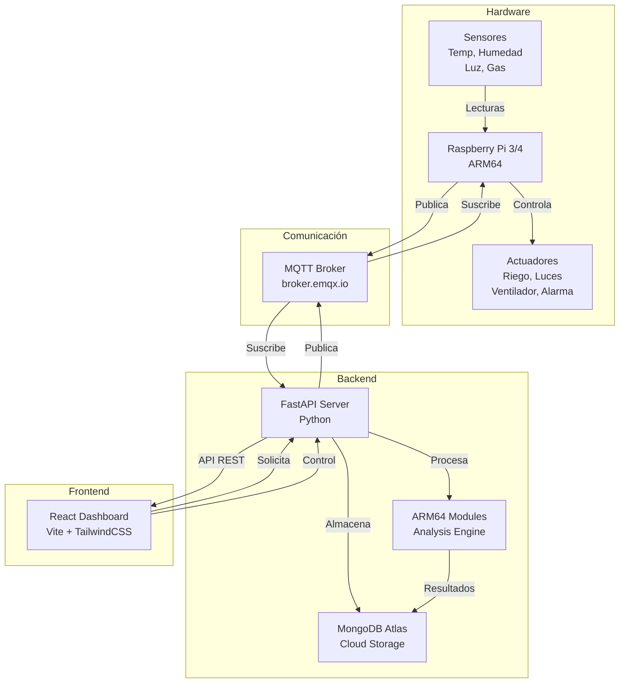
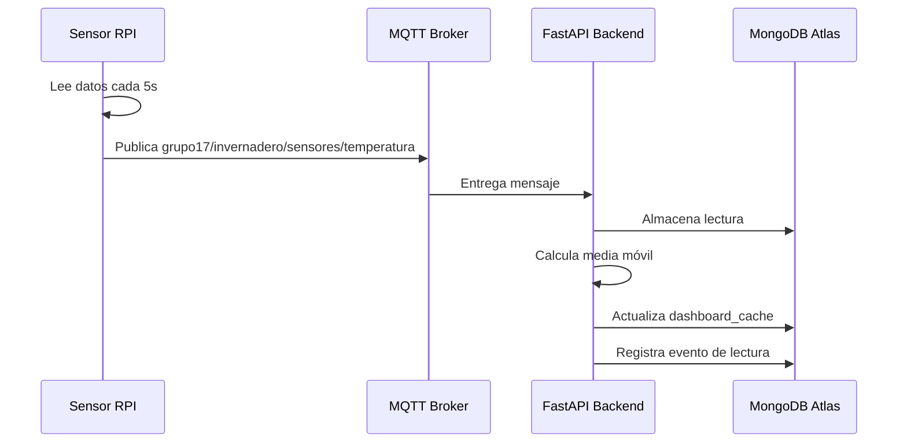
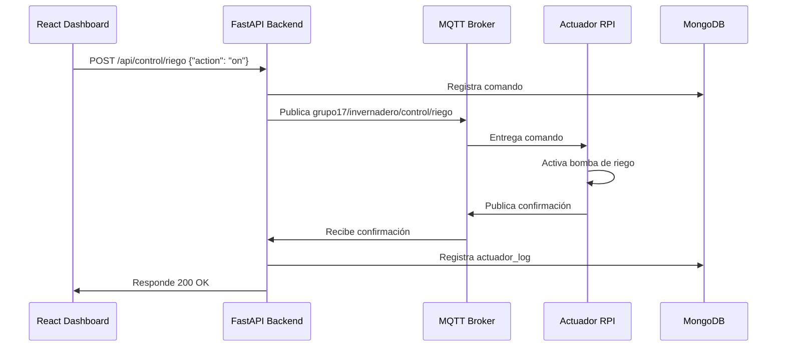
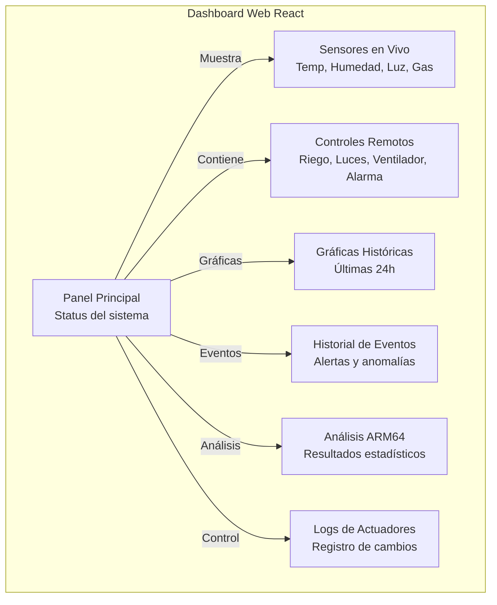
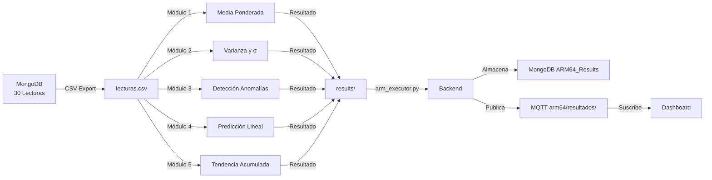

# INFORME TÉCNICO GENERAL
## Sistema de Monitoreo y Control Inteligente para Invernadero IoT

**Grupo 17 - ACYE1 - Semestre 1 2026**

---

## Tabla de Contenidos

1. [Introducción](#introducción)
2. [Objetivos](#objetivos)
3. [Arquitectura General del Sistema](#arquitectura-general-del-sistema)
4. [Estructura Física del Invernadero](#estructura-física-del-invernadero)
5. [Hardware Utilizado](#hardware-utilizado)
6. [Lógica de Control en Python](#lógica-de-control-en-python)
7. [Comunicación MQTT](#comunicación-mqtt)
8. [Base de Datos MongoDB Atlas](#base-de-datos-mongodb-atlas)
9. [Dashboard Web](#dashboard-web)
10. [Integración ARM64 con el Sistema IoT](#integración-arm64-con-el-sistema-iot)
11. [Conclusiones](#conclusiones)

---

## 1. Introducción

El Sistema de Monitoreo y Control Inteligente para Invernadero IoT es una solución completa que integra hardware embebido (ARM64), comunicación en tiempo real (MQTT), análisis de datos estadísticos y una interfaz web moderna.

El sistema captura datos ambientales (temperatura, humedad, luz, nivel de gas) del invernadero, realiza análisis avanzados mediante módulos ARM64 especializados, y proporciona control remoto de actuadores (riego, luces, ventilación, alarma).

**Tecnologías clave:**
- **Backend:** FastAPI (Python) + MongoDB
- **Frontend:** React + Vite + TailwindCSS
- **IoT Communication:** MQTT (broker.emqx.io)
- **Análisis ARM64:** Ensamblador AArch64
- **Procesamiento en tiempo real:** Simulador de sensores

---

## 2. Objetivos

### 2.1 Objetivo General
Diseñar e implementar un sistema IoT integrado para el monitoreo automático de un invernadero con capacidad de control remoto y análisis estadístico avanzado mediante procesamiento ARM64.

### 2.2 Objetivos Específicos

1. **Captura de datos en tiempo real**
   - Recopilar lecturas de sensores (temperatura, humedad, luz, gas)
   - Almacenar datos en base de datos centralizada
   - Simular sensores para pruebas sin hardware físico

2. **Análisis estadístico mediante ARM64**
   - Calcular media ponderada de temperatura
   - Computar varianza y desviación estándar
   - Detectar anomalías estadísticas
   - Predecir valores futuros
   - Analizar tendencias

3. **Control remoto de actuadores**
   - Activar/desactivar riego automático
   - Controlar sistemas de iluminación
   - Administrar ventilación
   - Activar alarmas de emergencia
   - Cambiar modos de operación

4. **Visualización y reporte**
   - Dashboard web en tiempo real
   - Gráficas históricas de sensores
   - Historial de eventos y comandos
   - Visualización de resultados ARM64

---

## 3. Arquitectura General del Sistema

### 3.1 Diagrama de Arquitectura General



### 3.2 Componentes Principales

| Componente | Descripción | Tecnología |
|---|---|---|
| **Sensores** | Captura datos ambientales | DHT22, LDR, MQ135 |
| **Raspberry Pi** | Placa controladora principal | ARM64 (AArch64) |
| **FastAPI Backend** | API REST y lógica de negocio | Python 3.10+ |
| **MongoDB Atlas** | Base de datos NoSQL en la nube | Cloud MongoDB |
| **MQTT Broker** | Comunicación pub/sub | broker.emqx.io |
| **React Frontend** | Interfaz de usuario | React 18 + Vite |
| **Módulos ARM64** | Análisis estadístico avanzado | Ensamblador AArch64 |

---

## 4. Estructura Física del Invernadero

### 4.1 Layout del Invernadero

```
┌─────────────────────────────────────────┐
│        INVERNADERO INTELIGENTE          │
├─────────────────────────────────────────┤
│                                         │
│  ┌──────────────┐      ┌──────────────┐ │
│  │  ÁREA 1      │      │  ÁREA 2      │ │
│  │ (Riego Auto) │      │(Monitoreo)   │ │
│  │              │      │              │ │
│  │ Sensores:    │      │ Sensores:    │ │
│  │ • Temp       │      │ • Temp       │ │
│  │ • Hum Aire   │      │ • Hum Aire   │ │
│  │ • Hum Suelo  │      │ • Hum Suelo  │ │
│  │ • Luz        │      │ • Luz        │ │
│  │ • Gas        │      │ • Gas        │ │
│  │              │      │              │ │
│  │ Actuadores:  │      │ Actuadores:  │ │
│  │ • Bomba agua │      │ • Ventilador │ │
│  │ • Luces LED  │      │ • Luces LED  │ │
│  └──────────────┘      └──────────────┘ │
│                                         │
│        [Raspberry Pi + Sensores]        │
│        [Control Unit @ Centro]          │
│                                         │
└─────────────────────────────────────────┘
```

### 4.2 Zonas de Cobertura

- **Zona 1:** Cultivos principales (temperatura: 22-26°C, humedad: 60-80%)
- **Zona 2:** Área de reproducción (temperatura: 18-24°C, humedad: 50-70%)
- **Centro de Control:** Raspberry Pi + hub de sensores + distribuidor de actuadores

---

## 5. Hardware Utilizado

### 5.1 Plataforma Principal

| Item | Especificaciones |
|---|---|
| **Procesador Principal** | Raspberry Pi 3/4 Model B+ (ARM64) |
| **CPU** | Broadcom BCM2711 / BCM2835 |
| **RAM** | 2-8 GB LPDDR4 |
| **Almacenamiento** | microSD 32-64 GB |
| **Conectividad** | Ethernet + WiFi 802.11ac |
| **Puertos GPIO** | 40 pines (3.3V, 5V, GND) |

### 5.2 Sensores

```
SENSOR DIAGRAM:

┌─────────────────────────────────────┐
│      Multiplicador I2C/1-Wire       │
│    (Expandir cantidad de sensores)  │
└────────┬────────────────────────────┘
         │
    ┌────┴────┬────────┬────────┬─────┐
    │          │        │        │     │
    ▼          ▼        ▼        ▼     ▼
  DHT22      DHT22     LDR      MQ135 LDR
  (Temp)  (Humedad)  (Luz1)    (Gas) (Luz2)
   Zona1    Zona1     Zona1    Ambos  Zona2
    
Especificaciones:

DHT22 (Temperatura/Humedad):
  • Rango Temp: -40 a +80°C (precisión ±0.5°C)
  • Rango Hum: 0-100% RH (precisión ±2%)
  • Interfaz: 1-Wire digital
  • Tiempo de muestreo: 2 segundos

LDR (Sensor de Luz):
  • Rango: 0-100,000 lux
  • Salida: Analógica (0-3.3V) → ADC
  • Precisión: ±10% típico

MQ135 (Sensor de Gas):
  • Rango: 10-1000 ppm CO2
  • Salida: Analógica (0-5V) → ADC
  • Tiempo de respuesta: <10 segundos
```

### 5.3 Actuadores

| Actuador | Especificación | Control |
|---|---|---|
| **Bomba de riego** | 12V DC, 0.5A | Relé GPIO |
| **Luces LED** | 5-12V, 10-20W | MOSFET PWM |
| **Ventilador** | 5-12V DC | MOSFET velocidad variable |
| **Buzzer/Alarma** | 5V, 85dB | GPIO digital |

### 5.4 Diagrama de Pinout Raspberry Pi

```
PINOUT GPIO RASPBERRY PI 4:

┌───────────────────────────┐
│   RPI 4 GPIO Header       │
├──────┬────────────────────┤
│ 3V3  │  GPIO 2 (SDA)      │  I2C Sensores
│ 5V   │  GPIO 3 (SCL)      │  I2C Sensores
│ GND  │  GPIO 4            │  Sensor Temp
│ GPIO17   GPIO 27          │   
│ GPIO22   GPIO 10          │   SPI
│ GPIO23   GPIO 11          │  SPI
│ GND      GPIO 24          │
│ GPIO25   GPIO 8           │
│ GPIO7    GND              │
├──────┬────────────────────┤
│ BOMBA: GPIO 18 (PWM)      │
│ LUCES: GPIO 19 (PWM)      │
│ VENTILADOR: GPIO 20 (PWM) │
│ ALARMA: GPIO 21 (Digital) │
└───────────────────────────┘
```

[AGREGA DIAGRAMA DE CIRCUITO ESQUEMÁTICO]

---

## 6. Lógica de Control en Python

### 6.1 Estructura del Backend

```
backend/
├── app/
│   ├── main.py              # Entrypoint FastAPI
│   ├── config.py            # Configuración centralizada
│   ├── db.py                # Modelos MongoDB
│   ├── schemas.py           # Pydantic schemas
│   ├── mqtt/
│   │   ├── connection_manager.py
│   │   ├── subscriber.py
│   │   ├── handlers.py
│   │   └── publisher.py
│   ├── routers/
│   │   ├── sensors.py       # GET datos de sensores
│   │   ├── commands.py      # POST comandos
│   │   ├── control.py       # PUT control de actuadores
│   │   ├── status.py        # GET estado del sistema
│   │   ├── events.py        # GET historial de eventos
│   │   ├── arm64.py         # GET resultados análisis
│   │   └── actuator_logs.py # GET logs de actuadores
│   └── services/
│       ├── sensor_service.py
│       └── control_service.py
├── simulador.py             # Simulador de sensores
├── generate_lecturas.py     # Generador de CSV
├── requirements.txt
└── .env
```

### 6.2 Flujo de Datos Captura



### 6.3 Flujo de Control de Actuadores



### 6.4 Modelos de Base de Datos

```python
# Lectura de Sensor
{
    "_id": ObjectId,
    "timestamp": datetime,
    "tipo": "TEMP|HUMIDITY|LIGHT|GAS",
    "zona": 1 | 2,
    "valor": float,
    "unidad": "°C|%|lux|ppm"
}

# Comando
{
    "_id": ObjectId,
    "timestamp": datetime,
    "tipo": "RIEGO|LUCES|VENTILADOR|ALARMA|MODO",
    "accion": "ON|OFF|SPEED_XX",
    "ejecutado": boolean,
    "resultado": "OK|ERROR"
}

# Evento del Sistema
{
    "_id": ObjectId,
    "timestamp": datetime,
    "tipo": "ALERTA|ANOMALIA|INFO",
    "descripcion": string,
    "severidad": "INFO|WARNING|CRITICAL"
}

# Resultado ARM64
{
    "_id": ObjectId,
    "timestamp": datetime,
    "modulo": 1..5,
    "module_name": "WEIGHTED_MEAN|VARIANCE|ANOMALY_DETECTION|PREDICTION|ADVANCED_TREND",
    "resultados": {
        // Específico por módulo
    }
}
```

---

## 7. Comunicación MQTT

### 7.1 Topología de Tópicos

```
grupo17/invernadero/
├── sensores/
│   ├── temperatura      → {"value": 24.5, "zona": 1}
│   ├── humedad          → {"value": 65.2, "zona": 1}
│   ├── luz_zona1        → {"value": 450, "lux": true}
│   ├── luz_zona2        → {"value": 320, "lux": true}
│   ├── humedad_suelo_1  → {"value": 52.6, "%": true}
│   ├── humedad_suelo_2  → {"value": 42.6, "%": true}
│   └── gas              → {"value": 78.4, "ppm": true}
│
├── actuadores/
│   ├── riego            → {"command": "on|off"}
│   ├── luces            → {"command": "on|off", "brightness": 0-100}
│   ├── ventilador       → {"command": "on|off|speed", "value": 0-100}
│   └── alarma           → {"command": "on|off"}
│
├── control/
│   ├── modo             → {"modo": "AUTO|MANUAL"}
│   └── configuracion    → {"setting": "value"}
│
├── eventos/
│   ├── alerta           → {"tipo": "EMERGENCIA|ANOMALIA"}
│   └── log              → {"evento": "descripcion"}
│
└── arm64/
    ├── resultados/1     → {"module": "WEIGHTED_MEAN", ...}
    ├── resultados/2     → {"module": "VARIANCE", ...}
    ├── resultados/3     → {"module": "ANOMALY_DETECTION", ...}
    ├── resultados/4     → {"module": "PREDICTION", ...}
    └── resultados/5     → {"module": "ADVANCED_TREND", ...}
```

### 7.2 Broker MQTT

```
Broker: broker.emqx.io
Puerto HTTP: 1883
Puerto MQTT SSL: 8883

Acceso desde MQTTX Web:
  http://www.emqx.io/en/products/mqttx

Credenciales (Configurables):
  Usuario: [CONFIGURAR EN .env]
  Contraseña: [CONFIGURAR EN .env]

Características:
  • No requiere instalación local
  • Soporta 10,000+ conexiones simultáneas
  • Cloud hosting gratuito para desarrollo
  • Dashboard web de monitoreo
  • Retención de mensajes configurable
```

### 7.3 Publicadores y Suscriptores

| Entidad | Publica | Suscribe |
|---|---|---|
| **Raspberry Pi** | sensores/*, actuadores/* | control/*, comandos/* |
| **Backend** | eventos/*, arm64/resultados/* | sensores/*, actuadores/estado/* |
| **Dashboard** | - | sensores/*, eventos/*, arm64/* |
| **Simulador** | sensores/* | - |

---

## 8. Base de Datos MongoDB Atlas

### 8.1 Configuración MongoDB Atlas

```
Cluster: invernadero-iot
Región: us-east-1 (Virginia)
Tier: M0 Sandbox (Gratuito)

Conexión:
  mongodb+srv://<user>:<password>@cluster0.xxxxx.mongodb.net/?retryWrites=true&w=majority

Colecciones:
  • readings                (índices: timestamp, tipo, zona)
  • commands                (índices: timestamp, tipo)
  • events                  (índices: timestamp, severidad)
  • arm64_results           (índices: timestamp, modulo)
  • actuator_logs           (índices: timestamp, actuador)
  • system_state            (singleton)
  • dashboard_cache         (singleton, TTL: 300s)
```

### 8.2 Índices Optimizados

```javascript
// readings
db.readings.createIndex({ "timestamp": -1 })
db.readings.createIndex({ "tipo": 1, "timestamp": -1 })
db.readings.createIndex({ "zona": 1 })

// commands
db.commands.createIndex({ "timestamp": -1 })
db.commands.createIndex({ "tipo": 1 })

// events
db.events.createIndex({ "timestamp": -1 })
db.events.createIndex({ "severidad": 1 })

// arm64_results
db.arm64_results.createIndex({ "timestamp": -1 })
db.arm64_results.createIndex({ "modulo": 1 })

// dashboard_cache (TTL: 5 minutos)
db.dashboard_cache.createIndex({ "expireAt": 1 }, { "expireAfterSeconds": 300 })
```

### 8.3 Políticas de Retención

| Colección | Política | TTL |
|---|---|---|
| readings | Retener último mes, agregado después | 30 días |
| commands | Retener histórico completo | Infinito |
| events | Retener últimos 3 meses | 90 días |
| arm64_results | Retener últimos 7 días | 7 días |
| actuator_logs | Retener histórico completo | Infinito |

---

## 9. Dashboard Web

### 9.1 Arquitectura Frontend

```
frontend/
├── src/
│   ├── App.tsx                # Componente raíz
│   ├── main.tsx               # Entrypoint
│   ├── types.ts               # TypeScript types
│   ├── lib/
│   │   ├── api.ts             # Cliente HTTP (fetch)
│   │   └── mqttClient.ts      # Cliente MQTT
│   └── components/
│       ├── DashboardPanel.tsx     # Panel principal
│       ├── SensorGraph.tsx        # Gráficas históricas
│       ├── ControlPanel.tsx       # Controles remotos
│       ├── EventLog.tsx           # Historial de eventos
│       ├── CommandLog.tsx         # Historial de comandos
│       └── ARM64Section.tsx       # Análisis ARM64
├── index.html
├── package.json
├── vite.config.ts
└── tailwind.config.ts
```

### 9.2 Componentes Principales del Dashboard



### 9.3 Pantallas principales

**[AGREGA CAPTURA DE PANTALLA DEL DASHBOARD PRINCIPAL]**

**[AGREGA CAPTURA DE PANTALLA DE GRÁFICAS]**

**[AGREGA CAPTURA DE PANTALLA DE CONTROLES]**

**[AGREGA CAPTURA DE PANTALLA DE ANÁLISIS ARM64]**

---

## 10. Integración ARM64 con el Sistema IoT

### 10.1 Flujo de Procesamiento ARM64



### 10.2 Módulos ARM64

#### Módulo 1: Media Ponderada (Integrante 1)
- **Entrada:** Columna TEMP del CSV
- **Cálculo:** Σ(X_i × W_i) / ΣW_i, donde W_i = i (1..30)
- **Salida:** Media ponderada con 2 decimales

#### Módulo 2: Varianza y Desviación Estándar (Integrante 2)
- **Entrada:** Columna TEMP del CSV
- **Cálculo:** σ² = Σ(X_i - μ)² / N; σ = √(σ²)
- **Salida:** Media, Varianza, Desviación estándar

#### Módulo 3: Detección de Anomalías (Integrante 3)
- **Entrada:** Columna TEMP del CSV
- **Cálculo:** Z-score = |X_i - μ| / σ; umbral = |Z| > 3
- **Salida:** Cantidad de anomalías, nivel de riesgo (NORMAL/MEDIUM/HIGH)

#### Módulo 4: Predicción Lineal (Integrante 4)
- **Entrada:** Columna HUM_SUELO_2 del CSV
- **Cálculo:** Cambio promedio = (Final - Inicial) / 29; Next = Final + Cambio
- **Salida:** Predicción del próximo valor con 2 decimales

#### Módulo 5: Tendencia Acumulada (Integrante 5)
- **Entrada:** Columna TEMP del CSV
- **Cálculo:** Incrementos/Decrementos, rachas máximas, acumulado, dirección
- **Salida:** Tendencia (UP/DOWN/STABLE) con métricas detalladas

### 10.3 Pipeline de Ejecución

```bash
# 1. Generar CSV desde MongoDB
python3 generate_lecturas.py --from-db

# 2. Compilar todos los módulos
cd arm64
make all

# 3. Ejecutar módulos (producen results/)
make runall

# 4. Parsear resultados y enviar al backend
python3 arm_executor.py --parse-only --dir ../arm64 --url http://localhost:8000

# 5. Backend almacena en MongoDB y publica por MQTT
# 6. Dashboard recibe y visualiza resultados
```

---

## 11. Conclusiones

### 11.1 Logros Alcanzados

- Sistema integrado de IoT funcionalmente completo

- Captura de datos en tiempo real desde múltiples sensores

- Almacenamiento en MongoDB Atlas (cloud)

- Comunicación pub/sub vía MQTT

- Análisis estadístico avanzado mediante ARM64

- Dashboard web responsivo e interactivo

- Control remoto de actuadores

- Detección y alertas automáticas de anomalías

### 11.2 Características Implementadas

| Característica | Estado | Módulo |
|---|---|---|
| Captura de sensores | ✅ | Simulador + Raspberry Pi |
| Almacenamiento en MongoDB | ✅ | Backend |
| Comunicación MQTT | ✅ | Backend + Frontend |
| Dashboard web | ✅ | Frontend React |
| Control de actuadores | ✅ | Backend + MQTT |
| Análisis estadístico | ✅ | Módulos ARM64 (5) |
| Detección de anomalías | ✅ | Módulo 3 ARM64 |
| Predicciones | ✅ | Módulo 4 ARM64 |
| Tendencia análisis | ✅ | Módulo 5 ARM64 |

### 11.3 Escalabilidad y Mejoras Futuras

1. **Hardware:**
   - Integración de sensores adicionales (pH, CO2 específico)
   - Multizona con múltiples Raspberry Pi sincronizadas
   - Almacenamiento local con sincronización en la nube

2. **Software:**
   - Machine Learning para predicciones avanzadas
   - Alertas inteligentes basadas en ML
   - Integración con aplicación móvil nativa
   - Dashboard en 3D/realidad virtual
   - Webhook integrations (SMS, Telegram, Email)

3. **Análisis:**
   - Análisis de series temporales avanzado
   - Optimización de consumo energético
   - Análisis de correlación entre variables
   - Reportes automáticos periódicos

---

## Apéndice: Instalación y Puesta en Marcha

### A.1 Prerequisitos

```bash
# Sistema Operativo
Ubuntu 20.04+ o Raspberry Pi OS

# Herramientas necesarias
sudo apt update
sudo apt install python3-dev python3-pip python3-venv
sudo apt install aarch64-linux-gnu-as aarch64-linux-gnu-ld  # Para ARM64
sudo apt install qemu-aarch64 gdb-multiarch  # Para pruebas cruzadas
```

### A.2 Configuración Inicial

```bash
# 1. Clonar proyecto
git clone <repo-url>
cd Proyecto1

# 2. Crear entorno virtual
cd backend
python3 -m venv .venv
source .venv/bin/activate

# 3. Instalar dependencias
pip install -r requirements.txt

# 4. Configurar variables de entorno
cp .env.example .env
# Editar .env con credenciales MongoDB Atlas y MQTT

# 5. Inicializar base de datos
python3 -m app.seed

# 6. Iniciar backend
python3 -m uvicorn app.main:app --host 0.0.0.0 --port 8000

# 7. En otra terminal, frontend
cd ../frontend
pnpm install
pnpm dev

# 8. Abrir navegador
open http://localhost:5173
```

---

**Documento preparado por:** Grupo 17, ACYE1
**Fecha:** 2026

