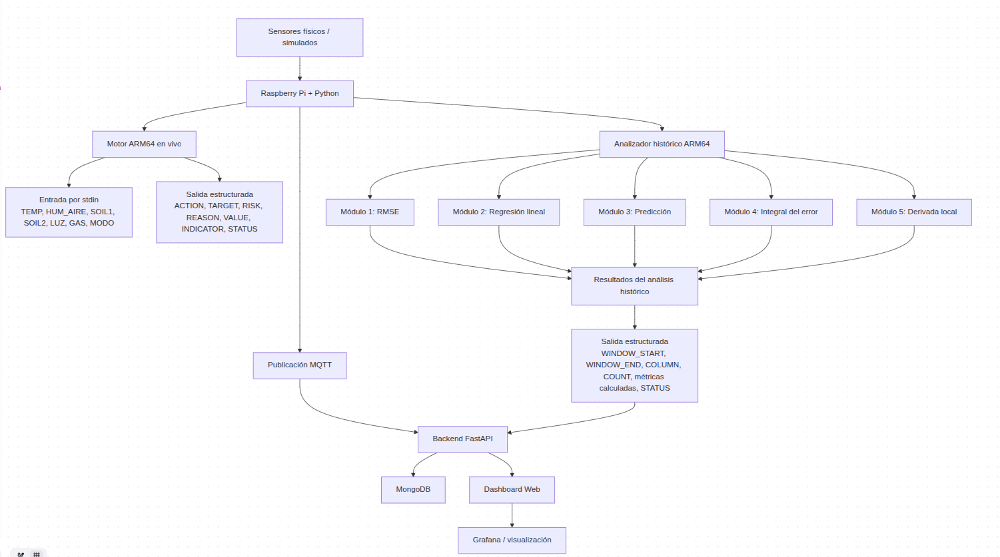
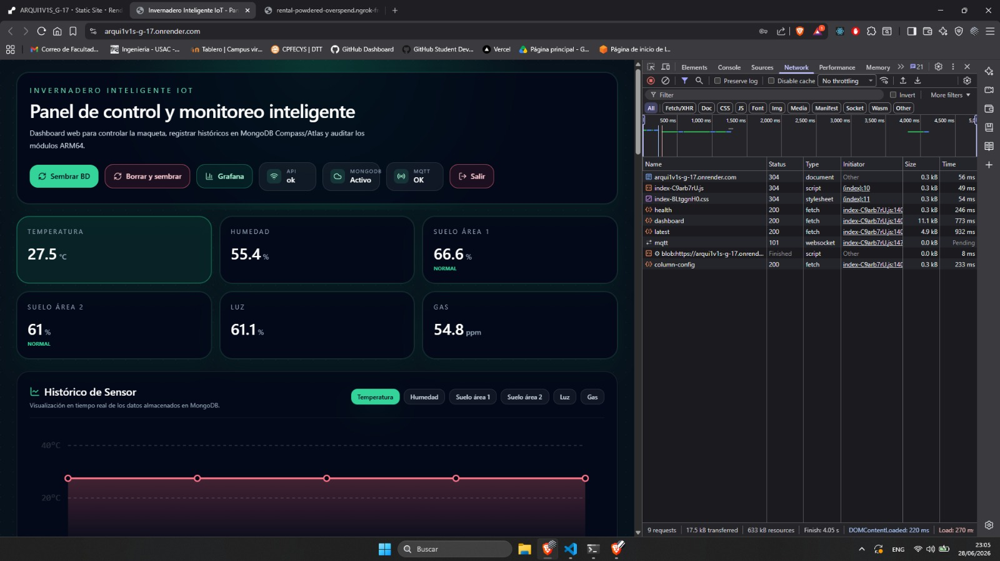

# Manual Técnico — Fase 2

## 1. Datos generales

**Proyecto:** Invernadero Inteligente IoT con Motor ARM64 de Decisión y Análisis Histórico  
**Grupo:** 17  
**Fase:** Fase 2  

## 2. Objetivo técnico

La Fase 2 amplía el sistema de Fase 1 integrando procesamiento en ARM64 para:

- Tomar decisiones en vivo a partir de lecturas enviadas desde Python.
- Procesar archivos históricos de lecturas por rango y columna.
- Registrar resultados de ARM64 en MongoDB.
- Visualizar lecturas, decisiones y resultados en dashboard web y Grafana.

La idea central es que Python coordina sensores, GPIO, MQTT, MongoDB y ejecución de procesos, pero los cálculos principales de análisis se realizan en ARM64.

## 3. Arquitectura general




## 4. Estructura actual del repositorio

```text
Proyecto1/
├── backend/
│   ├── app/
│   │   ├── main.py
│   │   ├── config.py
│   │   ├── db.py
│   │   ├── routers/
│   │   │   ├── sensors.py
│   │   │   ├── status.py
│   │   │   ├── control.py
│   │   │   ├── commands.py
│   │   │   ├── events.py
│   │   │   ├── actuator_logs.py
│   │   │   └── arm64.py
│   │   └── mqtt/
│   ├── generate_lecturas.py
│   ├── simulador.py
│   └── requirements.txt
├── frontend/
│   ├── src/
│   │   ├── App.tsx
│   │   ├── main.tsx
│   │   ├── types.ts
│   │   └── lib/
│   │       ├── api.ts
│   │       └── mqttClient.ts
│   ├── package.json
│   ├── vite.config.ts
│   └── tailwind.config.ts
├── raspberry/
│   ├── main.py
│   ├── arm_executor.py
│   ├── test_system.py
│   └── wiring.md
├── arm64/
│   ├── Makefile
│   ├── utils/
│   │   ├── utils.s
│   │   ├── copy_str.s
│   │   └── sqrt.s
│   ├── fase1/
│   └── fase2/
│       ├── Makefile
│       ├── live_engine/
│       │   ├── live_engine.s
│       │   ├── orquestador.py
│       │   └── test_motor.py
│       └── analyzer/modules/
│           ├── modulo_1_rmse/rmse.s
│           ├── modulo_2_regresion/varianza.s
│           ├── modulo_3_prediccion/predicciones.s
│           ├── modulo_4_integral_error/integrals.s
│           └── modulo_5_derivada_local/derivada.s
└── docs/
```

## 5. Herramientas utilizadas

| Tecnología | Uso actual |
|---|---|
| Raspberry Pi | Coordinación de sensores, actuadores, MQTT, GPIO y ejecución ARM64. |
| Python | Backend, scripts de Raspberry, orquestadores y ejecución de binarios ARM64. |
| ARM64 Assembly | Motor en vivo y módulos históricos. |
| FastAPI | API REST del sistema. |
| MongoDB | Persistencia de lecturas, estado, eventos, comandos, logs y resultados ARM64. |
| MQTT | Comunicación en tiempo real usando `broker.emqx.io`. |
| React 18 + Vite 6 | Dashboard web. |
| TypeScript | Código del frontend. |
| Tailwind CSS | Estilos del dashboard. |
| QEMU | Ejecución de binarios ARM64 en PC x86. |
| GDB multiarch | Depuración ARM64. |


## 6. Compilación general ARM64

Desde la raíz de ARM64:

```bash
cd Proyecto1/arm64
make all
```

El `Makefile` raíz compila:

```text
utils
fase1
fase2
```

Para compilar solamente Fase 2:

```bash
cd Proyecto1/arm64/fase2
make live_engine
make rmse
make varianza
make prediccion
make integrals
make derivada
```

El `Makefile` actual de Fase 2 contiene estos targets:

| Target | Binario generado | Fuente |
|---|---|---|
| `live_engine` | `build/live_engine` | `live_engine/live_engine.s` |
| `rmse` | `build/rmse` | `analyzer/modules/modulo_1_rmse/rmse.s` |
| `varianza` | `build/varianza` | `analyzer/modules/modulo_2_regresion/varianza.s` |
| `prediccion` | `build/prediccion` | `analyzer/modules/modulo_3_prediccion/predicciones.s` |
| `integrals` | `build/integrals` | `analyzer/modules/modulo_4_integral_error/integrals.s` |
| `derivada` | `build/derivada` | `analyzer/modules/modulo_5_derivada_local/derivada.s` |

## 7. Flujo del motor ARM64 en vivo

Ruta:

```text
Proyecto1/arm64/fase2/live_engine/live_engine.s
```

Entrada por `stdin`:

```text
TEMP,HUM_AIRE,SOIL1,SOIL2,LUZ,GAS,MODO
```

Ejemplo:

```text
31,68,34,41,280,160,0
```

Salida estructurada:

```text
ACTION=RIEGO_1_ON
TARGET=SOIL1
RISK=HIGH
REASON=SOIL_LOW_AND_DESCENDING
VALUE=34
INDICATOR=-6
STATUS=OK
```

Acciones existentes en el código ARM64:

| Acción | Uso |
|---|---|
| `ALARM_ON` | Alarma por gas o condición crítica. |
| `GAS_WARNING` | Advertencia por gas moderado. |
| `FAN_ON` | Encender ventilador. |
| `RIEGO_1_ON` | Riego área 1. |
| `RIEGO_2_ON` | Riego área 2. |
| `LIGHT_ON` | Encender iluminación. |
| `LED_GREEN` | Estado normal. |
| `LED_YELLOW` | Estado de advertencia. |
| `NO_ACTION` | Sin acción física. |

El motor también puede devolver error estructurado si la entrada no cumple con los 7 campos:

```text
STATUS=ERROR
ERROR=INVALID_INPUT
DETAIL=EXPECTED_7_FIELDS
```


## 8. Analizador histórico ARM64

El analizador histórico procesa `lecturas.csv` con rango y columna. El CSV usado por Fase 2 tiene este encabezado:

```text
ID,TEMP,HUM_AIRE,HUM_SUELO_1,HUM_SUELO_2,LUZ,GAS,RIEGO_1,RIEGO_2
```

Columnas válidas para los módulos históricos:

| Índice | Sensor |
|---:|---|
| 1 | TEMP |
| 2 | HUM_AIRE |
| 3 | HUM_SUELO_1 / SOIL1 |
| 4 | HUM_SUELO_2 / SOIL2 |
| 5 | LUZ |
| 6 | GAS |


## 9. Backend FastAPI

Ruta:

```text
Proyecto2/backend/
```

Ejecución local:

```bash
cd Proyecto1/backend
python3 -m venv .venv
source .venv/bin/activate
pip install -r requirements.txt
python3 -m uvicorn app.main:app --host 0.0.0.0 --port 8000 --reload
```

Verificación:

```bash
curl http://localhost:8000/api/health
```


## 10. Frontend

El frontend usa React + Vite + TypeScript + Tailwind. Se comunica con el backend por REST y con MQTT por WebSocket.

Comando de ejecución:

```bash
cd Proyecto1/frontend
pnpm install
pnpm dev
```





## 11. MongoDB

Colecciones usadas o esperadas:

| Colección | Uso |
|---|---|
| `sensor_readings` | Lecturas de sensores. |
| `system_status` | Estado global del sistema. |
| `events` | Eventos generados. |
| `commands` | Comandos desde dashboard o MQTT. |
| `actuator_logs` | Registro de acciones sobre actuadores. |
| `arm64_results` | Resultados de módulos ARM64. |
| `arm64_analysis_requests` | Solicitudes de análisis histórico. |
| `arm64_column_config` | Configuración de columnas ARM64. |


## 12. Grafana

Grafana debe mostrar lecturas históricas, decisiones, acciones ejecutadas, indicadores ARM64 y errores.

- Temperatura histórica.
- Humedad ambiental.
- Humedad de suelo por área.
- Luz.
- Gas.
- Acciones del motor ARM64.
- Resultados del analizador histórico.
- Errores ARM64.


-----------------------------------------

