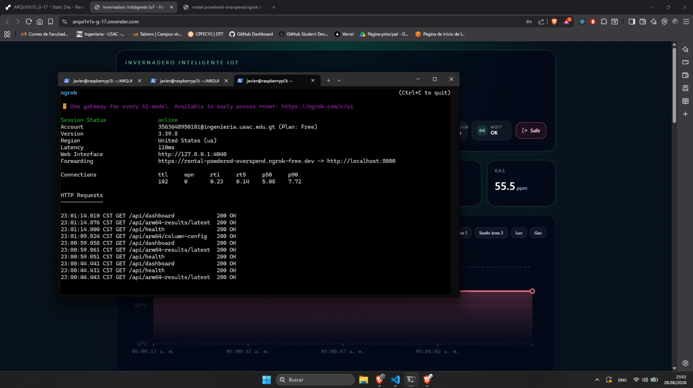
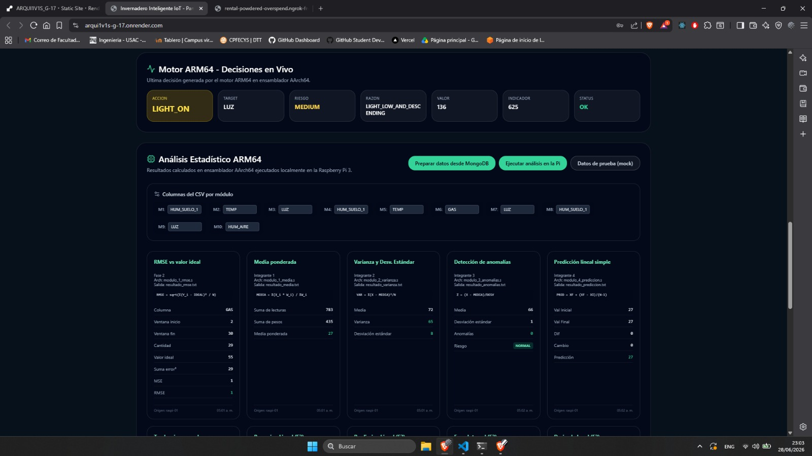
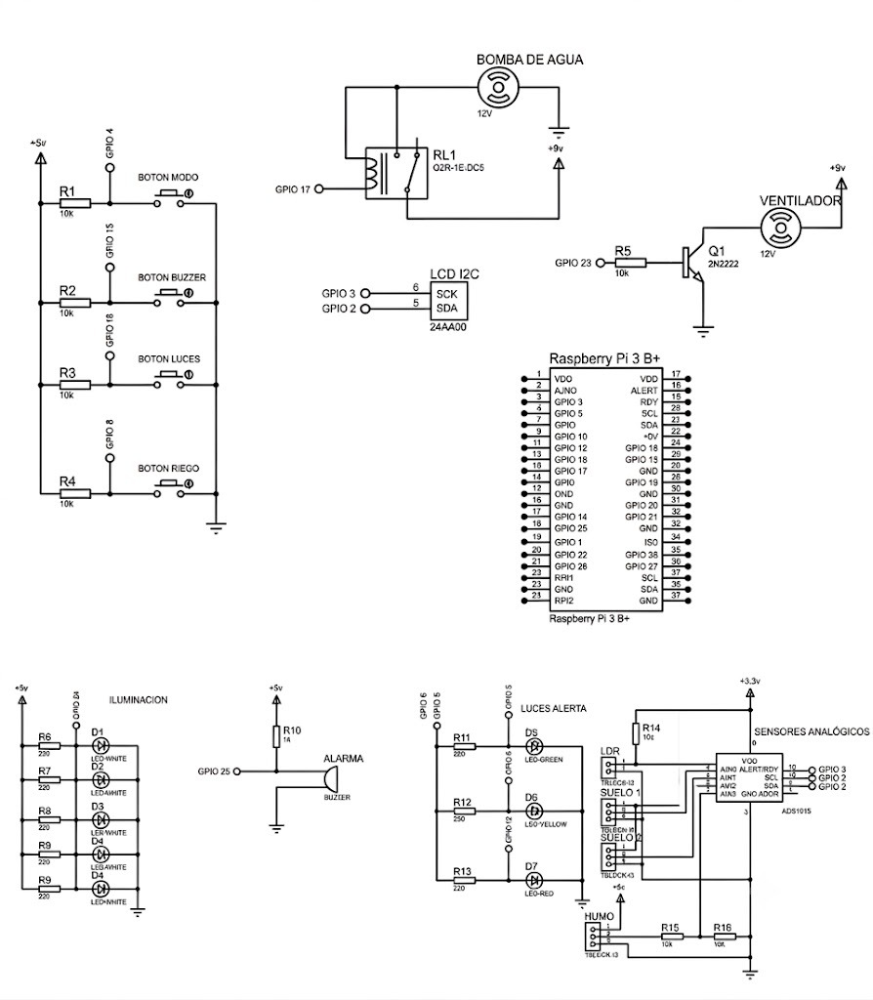
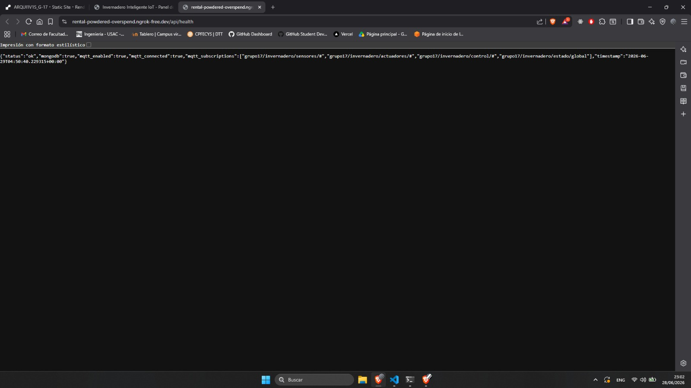
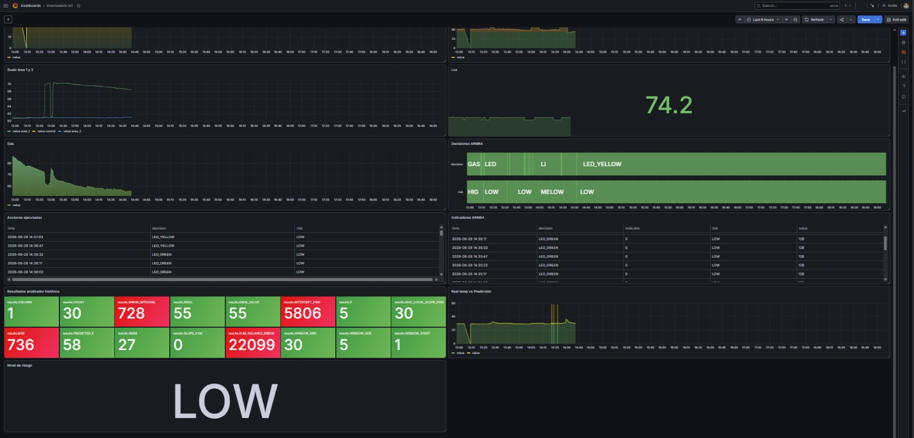

# Integración Backend, Frontend, Raspberry, MQTT, Grafana y Despliegue

## 1. Objetivo

Documentar en un solo reporte la integración general del sistema de Fase 2, incluyendo backend, frontend, Raspberry Pi, ejecución ARM64 en vivo, comunicación MQTT, almacenamiento en MongoDB, visualización en Grafana y despliegue con acceso protegido.

Este documento unifica la documentación de:

- Backend API con FastAPI, MongoDB, MQTT y ARM64.
- Frontend Dashboard con React, Vite y MQTT.
- Raspberry Pi con Python, GPIO, ARM64 en vivo y MQTT.
- Despliegue, Grafana y login.

---

## 2. Arquitectura general de integración

El sistema está compuesto por una Raspberry Pi que coordina sensores, actuadores, MQTT y ejecución ARM64. El backend recibe datos, comandos y resultados; el frontend permite consultar y controlar el sistema; MongoDB almacena lecturas, eventos y resultados; y Grafana permite visualizar métricas históricas.


---

## 3. Backend API

### 3.1 Descripción

El backend centraliza la comunicación entre el dashboard, MongoDB, MQTT, Raspberry Pi y resultados ARM64. Está implementado con FastAPI.

Ruta:

```text
Proyecto1/backend/
```

### Ejecución local

```bash
cd Proyecto1/backend
python3 -m venv .venv
source .venv/bin/activate
pip install -r requirements.txt
cp .env.example .env
python3 -m uvicorn app.main:app --host 0.0.0.0 --port 8000 --reload
```

### Verificación

```bash
curl http://localhost:8000/api/health
```


### Variables actuales

```env
MONGODB_URI=mongodb://localhost:27017
MONGODB_DB_NAME=invernadero_iot
CORS_ORIGINS=http://localhost:5173,http://localhost:3000
ENABLE_MQTT=true
MQTT_HOST=broker.emqx.io
MQTT_PORT=1883
MQTT_PORT_SSL=8883
MQTT_BASE_TOPIC=grupo17/invernadero
LOG_LEVEL=INFO
```

### Routers actuales

| Router | Uso |
|---|---|
| `sensors.py` | Lecturas recientes e históricas. |
| `status.py` | Estado general y dashboard. |
| `control.py` | Control de actuadores. |
| `commands.py` | Comandos del sistema. |
| `events.py` | Eventos. |
| `actuator_logs.py` | Logs de actuadores. |
| `arm64.py` | CSV, resultados y solicitudes ARM64. |

### Endpoints actuales

| Método | Endpoint |
|---|---|
| GET | `/api/health` |
| POST | `/api/mqtt/reconnect` |
| GET | `/api/status` |
| GET | `/api/dashboard` |
| POST | `/api/system-status` |
| POST | `/api/seed` |
| GET | `/api/sensors/latest` |
| GET | `/api/sensors/history` |
| GET | `/api/readings/latest` |
| POST | `/api/readings` |
| GET | `/api/events` |
| GET | `/api/events/latest` |
| POST | `/api/events` |
| GET | `/api/commands` |
| GET | `/api/commands/latest` |
| POST | `/api/commands` |
| GET | `/api/actuator-logs` |
| GET | `/api/actuator-logs/latest` |
| POST | `/api/actuator-logs` |
| POST | `/api/control/irrigation` |
| POST | `/api/control/lights` |
| POST | `/api/control/fan` |
| POST | `/api/control/alarm` |
| POST | `/api/control/mode` |
| POST | `/api/control/{actuator}` |
| GET | `/api/arm64/results` |
| GET | `/api/arm64-results/latest` |
| POST | `/api/arm64-results` |
| POST | `/api/arm64-results/mock?dev=true` |
| GET | `/api/arm64/csv` |
| POST | `/api/arm64/csv` |
| POST | `/api/arm64/run` |
| GET | `/api/arm64/column-config` |
| POST | `/api/arm64/column-config` |
| POST | `/api/arm64/historical-analysis` |
---

## 4. Frontend Dashboard

### 4.1 Descripción

El frontend es el dashboard web del invernadero. Permite consultar el estado actual, lecturas recientes, eventos, comandos, resultados ARM64 y controles del sistema.

Ruta:

```text
Proyecto1/frontend/
```

Tecnologías utilizadas:

- React 18.
- Vite.
- TypeScript.
- Tailwind CSS.
- MQTT WebSocket.
- REST API al backend FastAPI.

### 4.2 Ejecución local

```bash
cd Proyecto1/frontend
pnpm install
pnpm dev
```

Abrir:

```text
http://localhost:5173
```





### 4.3 Variables de entorno

Archivo:

```text
Proyecto1/frontend/.env.example
```

Contenido base:

```env
VITE_API_BASE_URL=http://localhost:8000
VITE_MQTT_URL=wss://broker.emqx.io:8084/mqtt
VITE_MQTT_CLIENT_ID=invernadero_dashboard_17
VITE_MQTT_BASE_TOPIC=grupo17/invernadero
```

### 4.4 Conexión con backend

Archivo principal de API:

```text
frontend/src/lib/api.ts
```

Funciones principales:

| Función | Endpoint |
|---|---|
| `getDashboard()` | `/api/dashboard` |
| `getHealth()` | `/api/health` |
| `createCommand()` | `/api/commands` |
| `createReading()` | `/api/readings` |
| `controlIrrigation()` | `/api/control/irrigation` |
| `controlLights()` | `/api/control/lights` |
| `controlFan()` | `/api/control/fan` |
| `controlAlarm()` | `/api/control/alarm` |
| `controlMode()` | `/api/control/mode` |
| `getARM64Results()` | `/api/arm64-results/latest` |
| `generateARM64CSV()` | `/api/arm64/csv` |
| `triggerARM64Run()` | `/api/arm64/run` |
| `runHistoricalAnalysis()` | `/api/arm64/historical-analysis` |

### 4.5 Conexión MQTT

Archivo:

```text
frontend/src/lib/mqttClient.ts
```

Uso principal:

- Conectar al broker por WebSocket.
- Suscribirse a topics del invernadero.
- Recibir actualizaciones en tiempo real.


### 4.6 Pantallas requeridas





### 4.7 Build de producción

```bash
cd Proyecto1/frontend
pnpm build
```

Vista previa:

```bash
pnpm preview
```

---

## 5. Raspberry Pi, ARM64 en vivo, MQTT y GPIO

### 5.1 Descripción

La Raspberry Pi coordina sensores, actuadores, MQTT y ejecución del motor ARM64. Python lee sensores y ejecuta GPIO, pero la decisión principal automática debe venir del motor ARM64.

Rutas principales:

```text
Proyecto1/raspberry/main.py
Proyecto1/raspberry/arm_executor.py
Proyecto1/arm64/fase2/live_engine/orquestador.py
Proyecto1/arm64/fase2/live_engine/live_engine.s
```

### 5.2 Variables de entorno Raspberry

Archivo:

```text
Proyecto1/raspberry/.env.example
```

Variables importantes:

```env
BACKEND_URL=http://localhost:8000
MQTT_HOST=broker.emqx.io
MQTT_PORT=1883
MQTT_BASE_TOPIC=grupo17/invernadero
DEVICE_ID=raspi-01
ENABLE_GPIO=false
POLL_INTERVAL_SECONDS=15
```

### 5.3 Sensores y actuadores

#### Sensores

| Sensor | Uso |
|---|---|
| DHT11/DHT22 | Temperatura y humedad ambiental. |
| Higrómetro área 1 | Humedad de suelo 1. |
| Higrómetro área 2 | Humedad de suelo 2. |
| LDR | Nivel de luz. |
| MQ | Gas/humo. |

#### Actuadores

| Actuador | Uso |
|---|---|
| Bomba de agua | Riego. |
| Válvulas | Selección de área. |
| Ventilador | Ventilación. |
| Luces | Iluminación artificial. |
| Buzzer | Alarma. |
| LEDs de estado | Estado normal, advertencia o crítico. |

### 5.4 Pines GPIO

Documentar según `raspberry/wiring.md`.





### 5.5 Motor ARM64 en vivo

Archivo:

```text
Proyecto1/arm64/fase2/live_engine/live_engine.s
```

Entrada esperada:

```text
TEMP,HUM_AIRE,SOIL1,SOIL2,LUZ,GAS,MODO
```

Ejemplo:

```text
31,68,34,41,280,160,0
```

Salida estructurada:

```text
ACTION=RIEGO_1_ON
TARGET=SOIL1
RISK=HIGH
REASON=SOIL_LOW_AND_DESCENDING
VALUE=34
INDICATOR=-6
STATUS=OK
```

### 5.6 Orquestador Python

Archivo:

```text
Proyecto1/arm64/fase2/live_engine/orquestador.py
```

Modos disponibles:

| Modo | Comando | Uso |
|---|---|---|
| test | `python3 orquestador.py` | Pruebas simuladas. |
| realtime | `python3 orquestador.py --mode realtime` | Sensores/GPIO reales. |
| file | `python3 orquestador.py --mode file --file datos.csv` | Lecturas desde archivo. |


### 5.7 Flujo de acción

```text
Lectura de sensores
  → Python construye línea CSV
  → ARM64 procesa indicadores
  → ARM64 devuelve ACTION/TARGET/RISK/REASON
  → Python valida acción
  → Python activa GPIO
  → Python registra en MongoDB
```

### 5.8 Acciones permitidas

| Acción | Descripción |
|---|---|
| `ALARM_ON` | Activar alarma por gas o condición crítica. |
| `RIEGO_1_ON` | Activar riego área 1. |
| `RIEGO_2_ON` | Activar riego área 2. |
| `FAN_ON` | Activar ventilador. |
| `LIGHT_ON` | Activar luces. |
| `LED_GREEN` | Estado normal. |
| `LED_YELLOW` | Advertencia. |
| `NO_ACTION` | No ejecutar acción física. |

### 5.9 Comandos de prueba

Compilar desde ARM64:

```bash
cd Proyecto1/arm64
make utils
make -C fase2 live_engine
```

Ejecutar orquestador sin GPIO ni MongoDB:

```bash
cd Proyecto1/arm64/fase2/live_engine
python3 orquestador.py --once --no-gpio --no-mongo
```

### 5.10 MQTT

Broker configurado:

```env
MQTT_HOST=broker.emqx.io
MQTT_PORT=1883
MQTT_BASE_TOPIC=grupo17/invernadero
```

Topics sugeridos:

```text
grupo17/invernadero/#
grupo17/invernadero/sensores
grupo17/invernadero/control
grupo17/invernadero/estado
```


---

## 6. Flujo de análisis histórico ARM64

El flujo de análisis histórico conecta el frontend, backend, MongoDB, MQTT, Raspberry y módulos ARM64.

```text
Frontend
  → POST /api/arm64/historical-analysis
  → Backend guarda solicitud en MongoDB
  → Backend publica comando MQTT para Raspberry Pi
  → Raspberry ejecuta módulo ARM64
  → Resultado se guarda en arm64_results
  → Dashboard consulta /api/arm64-results/latest
```

Si no hay Raspberry disponible, el backend incluye un modo simulado para algunas operaciones. Para evaluación final, los cálculos principales deben venir de los módulos ARM64.

### Flujo de CSV para ARM64

```text
MongoDB sensor_readings
  → backend genera filas normalizadas
  → lecturas.csv
  → ARM64 histórico
```

Formato esperado del CSV:

```text
ID,TEMP,HUM_AIRE,HUM_SUELO_1,HUM_SUELO_2,LUZ,GAS,RIEGO_1,RIEGO_2
```


---

## 7. Despliegue, Grafana y login


### 7.1 Credenciales de prueba


| Campo | Valor |
|---|---|
| Usuario | admin |
| Contraseña | admin123 |

### 7.2 Despliegue frontend

Build:

```bash
cd Proyecto1/frontend
pnpm install
pnpm build
```

Variables de producción:

```env
VITE_API_BASE_URL=https://<backend-publico>
VITE_MQTT_URL=wss://broker.emqx.io:8084/mqtt
VITE_MQTT_CLIENT_ID=invernadero_dashboard_17
VITE_MQTT_BASE_TOPIC=grupo17/invernadero
```


### 7.3 Despliegue backend

Variables:

```env
MONGODB_URI=<mongodb_atlas_uri>
MONGODB_DB_NAME=invernadero_iot
CORS_ORIGINS=<url_frontend>
ENABLE_MQTT=true
MQTT_HOST=broker.emqx.io
MQTT_PORT=1883
MQTT_BASE_TOPIC=grupo17/invernadero
```

Comando local equivalente:

```bash
python3 -m uvicorn app.main:app --host 0.0.0.0 --port 8000
```



### 7.4 Grafana

Grafana debe mostrar paneles relacionados con:

- Lecturas históricas de sensores.
- Decisiones emitidas por ARM64.
- Acciones ejecutadas por Python.
- Indicadores calculados por ARM64.
- Resultados por rango y columna.
- Errores de módulos ARM64.
- Nivel de riesgo.


---
## 8. Build de producción

Frontend:

```bash
cd Proyecto1/frontend
pnpm build
pnpm preview
```

Backend local equivalente:

```bash
cd Proyecto1/backend
source .venv/bin/activate
python3 -m uvicorn app.main:app --host 0.0.0.0 --port 8000