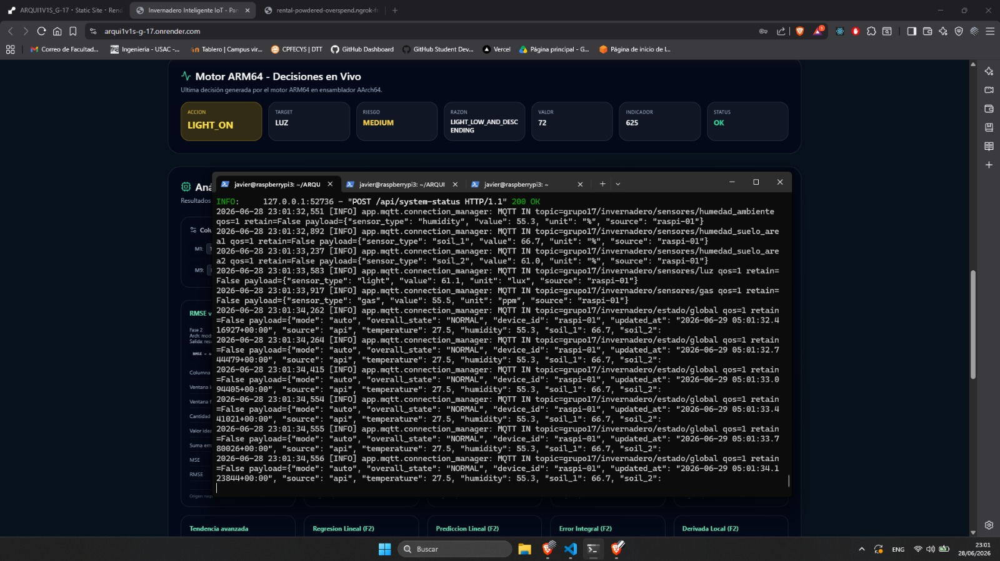

# Manual de Usuario — Fase 2

## 1. Objetivo

Este manual explica cómo usar el sistema desde el punto de vista del usuario: iniciar servicios, abrir el dashboard, revisar sensores, controlar actuadores, ejecutar análisis ARM64 y consultar resultados.

## 2. Requisitos previos

- Python 3.10 o superior.
- Node.js 18 o superior.
- `pnpm`.
- MongoDB local o MongoDB Atlas.
- Herramientas ARM64: `aarch64-linux-gnu-as`, `aarch64-linux-gnu-ld`, `qemu-aarch64` y `gdb-multiarch`.
- Acceso al broker MQTT `broker.emqx.io`.


## 3. Iniciar backend

```bash
cd Proyecto1/backend
source .venv/bin/activate
python3 -m uvicorn app.main:app --host 0.0.0.0 --port 8000 --reload
```

Verificar:

```bash
http://localhost:8000/api/health
```


```md

```

## 4. Iniciar frontend

```bash
cd Proyecto1/frontend
pnpm install
pnpm dev
```

Abrir:

```text
http://localhost:5173
```


```md

```

## 5. Acceso al dashboard


| Campo | Valor |
|---|---|
| Usuario | `admin` |
| Contraseña | `admin123` |


## 6. Pantalla principal

En el dashboard se visualiza:

- Estado de API, MongoDB y MQTT.
- Temperatura.
- Humedad ambiental.
- Humedad de suelo área 1.
- Humedad de suelo área 2.
- Luz.
- Gas.
- Estado de bomba, ventilador, luces y buzzer.
- Lecturas recientes.
- Eventos recientes.
- Comandos recientes.
- Resultados ARM64.
- Formulario de análisis histórico.

```md

```

## 7. Control manual de actuadores

Desde el dashboard se pueden enviar comandos para:

| Acción | Descripción |
|---|---|
| Modo automático | Cambia el sistema a modo `auto`. |
| Modo manual | Cambia el sistema a modo `manual`. |
| Riego Área 1 / Área 2 ON | Envía comando de riego para el área seleccionada. |
| Riego Área 1 / Área 2 OFF | Apaga riego del área seleccionada. |
| Apagar bomba | Apaga bomba sin área específica. |
| Ventilación ON/OFF | Controla ventilador. |
| Luces ON/OFF | Controla iluminación. |
| Silenciar buzzer | Envía estado `mute`. |
| Activar buzzer | Enciende alarma/buzzer. |


```md

```

## 8. Generar datos para ARM64

Desde el dashboard o backend se puede generar un archivo CSV para análisis ARM64.

Endpoint relacionado:

```text
POST /api/arm64/csv
```

Desde terminal:

```bash
curl -X POST http://localhost:8000/api/arm64/csv
```

## 9. Ejecutar análisis histórico ARM64

El usuario selecciona:

- Archivo de entrada.
- Línea inicial.
- Línea final.
- Columna.
- Valor ideal cuando aplica.
- Módulo a ejecutar.

Endpoint:

```text
POST /api/arm64/historical-analysis
```

Ejemplo de payload:

```json
{
  "file": "lecturas.csv",
  "start_line": 11,
  "end_line": 30,
  "column": 3,
  "ideal_value": 55,
  "module": "ERROR_INTEGRAL"
}
```


## 10. Ejecutar pruebas ARM64 desde terminal

Entrar a Fase 2:

```bash
cd Proyecto1/arm64/fase2
```

Compilar:

```bash
make rmse
make varianza
make prediccion
make integrals
make derivada
```

Ejecutar módulos:

```bash
qemu-aarch64 build/rmse ../fase1/lecturas.csv 11 30 3 55
qemu-aarch64 build/varianza ../fase1/lecturas.csv 11 30 2
qemu-aarch64 build/prediccion ../fase1/lecturas.csv 11 30 2 3
qemu-aarch64 build/integrals ../fase1/lecturas.csv 11 30 3 55
qemu-aarch64 build/derivada ../fase1/lecturas.csv 11 30 3
```

## 11. Ejecutar Raspberry Pi + motor

Configurar variables:

```bash
cd Proyecto1/raspberry
cp .env.example .env
nano .env
```

Para pruebas en PC o modo simulado dejar:

```env
ENABLE_GPIO=false
```

Para Raspberry real:

```env
ENABLE_GPIO=true
```

Ejecutar:

```bash
python3 main.py
```


Compilar primero:

```bash
cd Proyecto1/arm64
make all
```

Ejecutar una prueba simulada:

```bash
cd Proyecto1/arm64/fase2/live_engine
python3 orquestador.py --once --no-gpio --no-mongo
```

Ejecutar en modo tiempo real:

```bash
python3 orquestador.py --mode realtime --interval 3 --api-url http://localhost:8000
```
---



---

