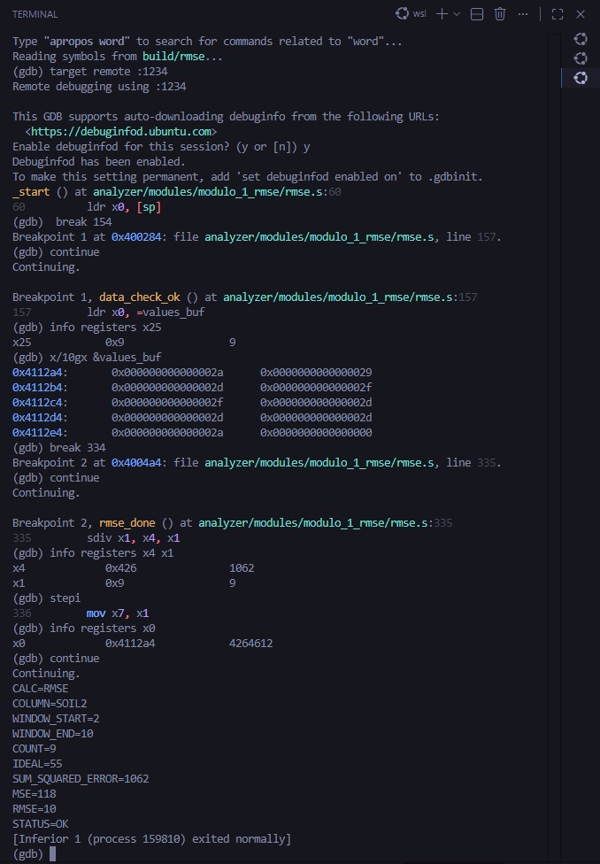
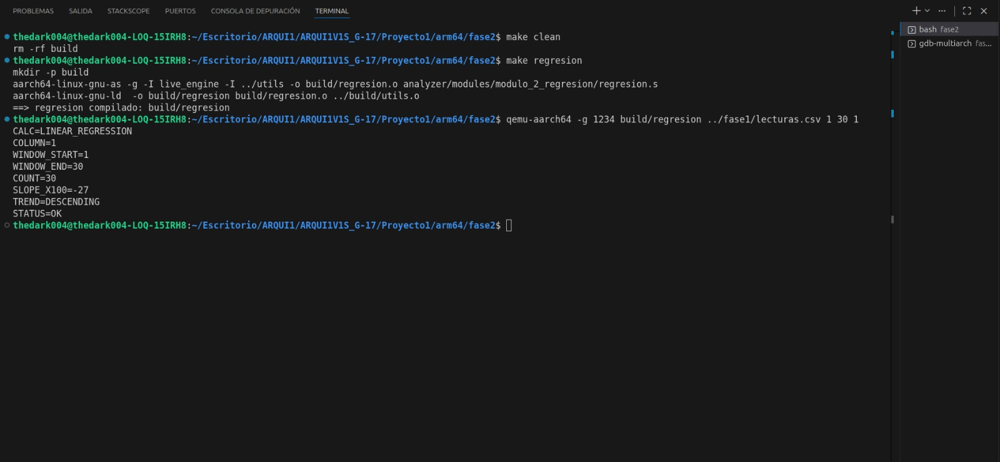
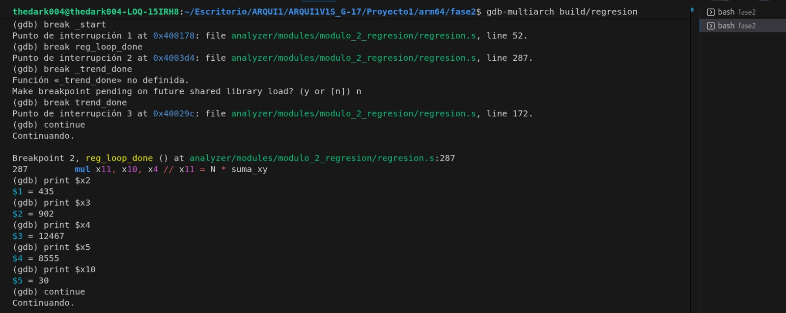
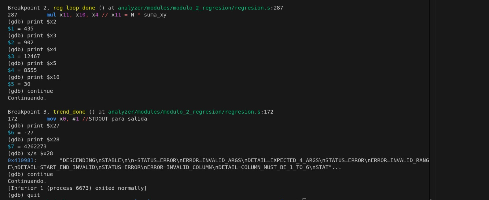
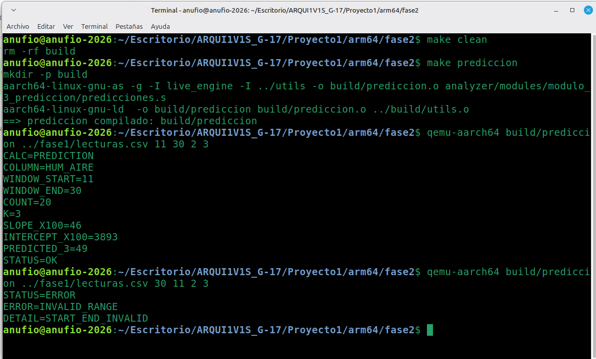
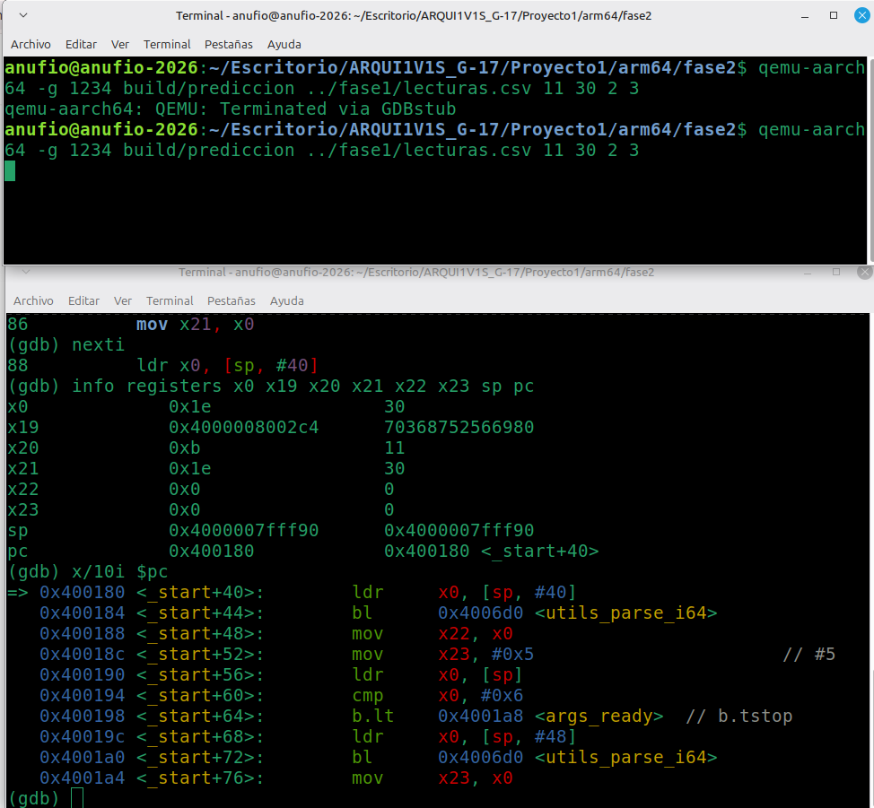
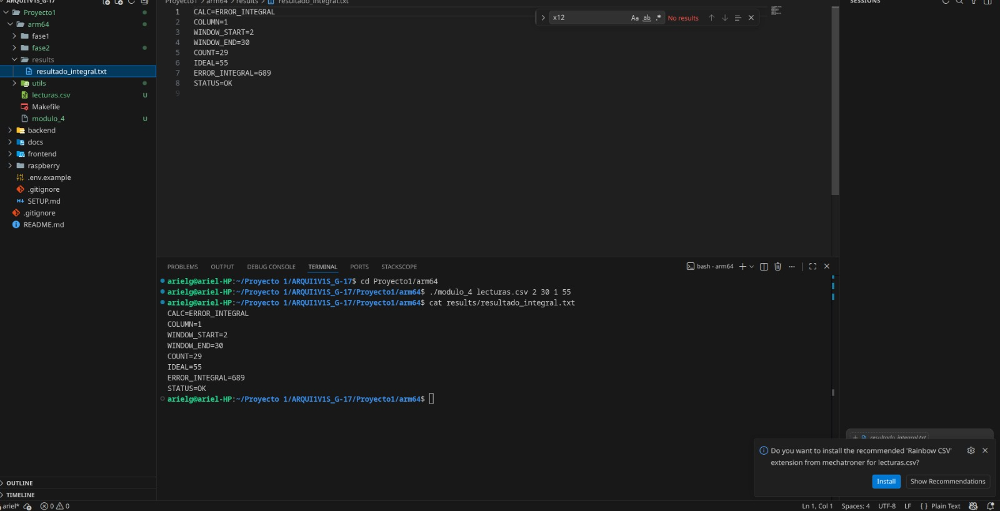
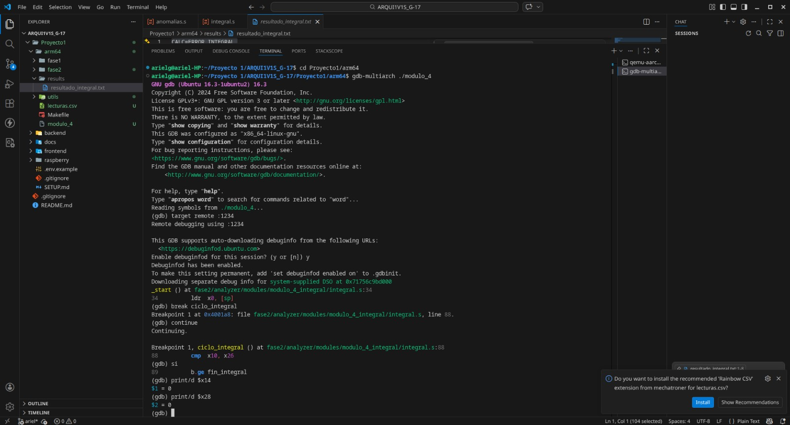
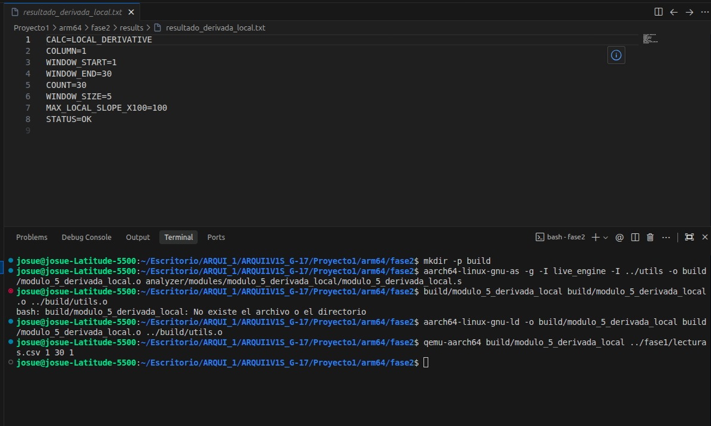
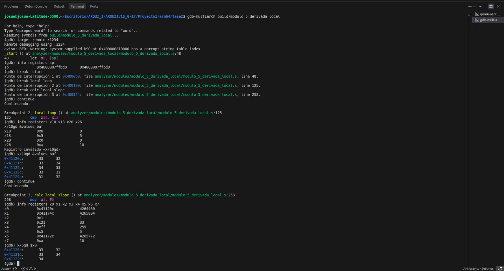

# Módulos ARM64 — Fase 2

## 1. Descripción general

Los módulos históricos ARM64 procesan un archivo de lecturas, reciben un rango de líneas y una columna, y calculan un indicador específico. Cada módulo genera salida estructurada con campos como `CALC`, `COLUMN`, `WINDOW_START`, `WINDOW_END`, `COUNT`, resultado principal y `STATUS`.

## 2. Columnas del CSV

El CSV usado contiene encabezado:

```text
ID,TEMP,HUM_AIRE,HUM_SUELO_1,HUM_SUELO_2,LUZ,GAS,RIEGO_1,RIEGO_2
```

En los módulos de Fase 2 se trabaja con índices de columna:

| Índice | Sensor |
|---:|---|
| 1 | TEMP |
| 2 | HUM_AIRE |
| 3 | HUM_SUELO_1 / SOIL1 |
| 4 | HUM_SUELO_2 / SOIL2 |
| 5 | LUZ |
| 6 | GAS |

## 3. Biblioteca común `utils.s`

Ruta:

```text
Proyecto1/arm64/utils/utils.s
```

Funciones comunes usadas por los módulos:

| Función | Uso |
|---|---|
| `utils_parse_i64` | Convierte texto ASCII a entero. |
| `utils_validate_range` | Valida inicio y fin del rango. |
| `utils_validate_column` | Valida columna entre 1 y 6. |
| `utils_read_int_column` | Lee valores de una columna dentro de un rango. |
| `utils_count_lines` | Cuenta líneas reales del archivo, sin encabezado. |
| `utils_close_csv` | Cierra descriptor de archivo. |
| `utils_i64_to_str` | Convierte entero a texto. |
| `utils_write_result` | Escribe resultado en archivo. |
| `utils_exit` | Termina el programa con código de salida. |

## 4. Compilación

Desde:

```bash
cd Proyecto1/arm64/fase2
```

Compilar todos los módulos históricos:

```bash
make rmse
make varianza
make prediccion
make integrals
make derivada
```

## 5. Módulo 1 — RMSE respecto a valor ideal

| Campo | Valor |
|---|---|
| Ruta | `arm64/fase2/analyzer/modules/modulo_1_rmse/rmse.s` |
| Target Makefile | `rmse` |
| Binario | `build/rmse` |
| Entrada | `archivo inicio fin columna ideal` |
| Salida principal | `RMSE` |
| Datos mínimos | 2 valores |

### Fórmula

```text
ERROR_i = Y_i - IDEAL
SUM_SQUARED_ERROR = suma(ERROR_i * ERROR_i)
MSE = SUM_SQUARED_ERROR / N
RMSE = sqrt(MSE)
```

Todas las operaciones se trabajan con enteros.

### Comando de prueba

```bash
qemu-aarch64 build/rmse ../fase1/lecturas.csv 11 30 3 55
```

### Salida esperada aproximada

```text
CALC=RMSE
COLUMN=3
WINDOW_START=11
WINDOW_END=30
COUNT=20
IDEAL=55
SUM_SQUARED_ERROR=...
MSE=...
RMSE=...
STATUS=OK
```

### Validaciones

- Argumentos suficientes.
- Archivo existente.
- Rango válido.
- Columna 1 a 6.
- Línea final dentro del archivo.
- Mínimo 2 datos.





## 6. Módulo 2 — Regresión lineal simple

| Campo | Valor |
|---|---|
| Ruta | `arm64/fase2/analyzer/modules/modulo_2_regresion/varianza.s` |
| Target Makefile | `varianza` |
| Binario | `build/varianza` |
| Entrada | `archivo inicio fin columna` |
| Salida principal | `SLOPE_X100`, `TREND` |
| Datos mínimos | 2 valores |

Nota: el archivo fuente y target se llaman `varianza` por estructura del repositorio, pero el contenido implementa regresión lineal simple.

### Fórmula

```text
NUMERADOR = (N * suma(X_i * Y_i)) - (suma(X_i) * suma(Y_i))
DENOMINADOR = (N * suma(X_i * X_i)) - (suma(X_i) * suma(X_i))
SLOPE_X100 = (NUMERADOR * 100) / DENOMINADOR
```

### Clasificación

| Condición | TREND |
|---|---|
| `SLOPE_X100 > 0` | `ASCENDING` |
| `SLOPE_X100 < 0` | `DESCENDING` |
| `SLOPE_X100 = 0` | `STABLE` |

### Comando de prueba

```bash
qemu-aarch64 build/varianza ../fase1/lecturas.csv 11 30 2
```

### Salida esperada

```text
CALC=LINEAR_REGRESSION
COLUMN=2
WINDOW_START=11
WINDOW_END=30
COUNT=20
SLOPE_X100=46
TREND=ASCENDING
STATUS=OK
```








## 7. Módulo 3 — Predicción futura por regresión

| Campo | Valor |
|---|---|
| Ruta | `arm64/fase2/analyzer/modules/modulo_3_prediccion/predicciones.s` |
| Target Makefile | `prediccion` |
| Binario | `build/prediccion` |
| Entrada | `archivo inicio fin columna k` |
| Salida principal | `PREDICTED_K` |
| Datos mínimos | 2 valores |

### Fórmula

Primero se calcula la recta por regresión:

```text
Y = mX + b
```

Con punto fijo x100:

```text
SLOPE_X100 = pendiente * 100
INTERCEPT_X100 = intercepto * 100
PREDICTED_K = (SLOPE_X100 * (N - 1 + K) + INTERCEPT_X100) / 100
```

### Comando de prueba

```bash
qemu-aarch64 build/prediccion ../fase1/lecturas.csv 11 30 2 3
```

### Salida esperada

```text
CALC=PREDICTION
COLUMN=2
WINDOW_START=11
WINDOW_END=30
COUNT=20
K=3
SLOPE_X100=46
INTERCEPT_X100=3893
PREDICTED_3=49
STATUS=OK
```






## 8. Módulo 4 — Integral del error por regla del trapecio

| Campo | Valor |
|---|---|
| Ruta | `arm64/fase2/analyzer/modules/modulo_4_integral_error/integrals.s` |
| Target Makefile | `integrals` |
| Binario | `build/integrals` |
| Entrada | `archivo inicio fin columna ideal` |
| Salida principal | `ERROR_INTEGRAL` |
| Datos mínimos | 2 valores |

### Fórmula

```text
ERROR_i = abs(Y_i - IDEAL)
ERROR_NEXT = abs(Y_(i+1) - IDEAL)
AREA_TRAPECIO = (ERROR_i + ERROR_NEXT) / 2
ERROR_INTEGRAL = suma(AREA_TRAPECIO)
```

### Comando de prueba

```bash
qemu-aarch64 build/integrals ../fase1/lecturas.csv 11 30 3 55
```

### Salida esperada

```text
CALC=ERROR_INTEGRAL
COLUMN=3
WINDOW_START=11
WINDOW_END=30
COUNT=20
IDEAL=55
ERROR_INTEGRAL=124
STATUS=OK
```

### Explicación de resultado

Para columna 3 (`HUM_SUELO_1`) y rango 11 a 30, el módulo toma 20 valores, calcula el error absoluto respecto a 55 y acumula el área por trapecios usando división entera truncada.






## 9. Módulo 5 — Derivada suavizada por regresión local

| Campo | Valor |
|---|---|
| Ruta | `arm64/fase2/analyzer/modules/modulo_5_derivada_local/derivada.s` |
| Target Makefile | `derivada` |
| Binario | `build/derivada` |
| Entrada | `archivo inicio fin columna` |
| Salida principal | `MAX_LOCAL_SLOPE_X100` |
| Datos mínimos | 5 valores |

### Fórmula

Usa ventanas locales de 5 datos. Para cada ventana se calcula la pendiente por regresión:

```text
LOCAL_SLOPE_X100 = ((5 * suma(X_i * Y_i) - 10 * suma(Y_i)) * 100) / 50
```

Luego se toma el mayor valor absoluto de pendiente local:

```text
MAX_LOCAL_SLOPE_X100 = max(abs(LOCAL_SLOPE_X100))
```

### Comando de prueba

```bash
qemu-aarch64 build/derivada ../fase1/lecturas.csv 11 30 3
```

### Salida esperada

```text
CALC=LOCAL_DERIVATIVE
COLUMN=3
WINDOW_START=11
WINDOW_END=30
COUNT=20
WINDOW_SIZE=5
MAX_LOCAL_SLOPE_X100=270
STATUS=OK
```






## 10. Errores estructurados comunes

| Error | Causa |
|---|---|
| `INVALID_ARGS` | Faltan argumentos. |
| `INVALID_RANGE` | Inicio/final inválidos o final fuera del archivo. |
| `INVALID_COLUMN` | Columna fuera de 1 a 6. |
| `FILE_NOT_FOUND` | No se pudo abrir el archivo CSV. |
| `INSUFFICIENT_DATA` | El rango no contiene suficientes datos para el cálculo. |
| `DIVISION_BY_ZERO` | Denominador cero en regresión/predicción. |

## 11. Notas para defensa individual

Cada integrante debe poder explicar:

1. Qué módulo le corresponde.
2. Qué archivo `.s` implementa el cálculo.
3. Qué argumentos recibe.
4. Qué validaciones hace antes de calcular.
5. Qué registros usa como acumuladores principales.
6. Qué fórmula implementa.
7. Por qué no se usa punto flotante.
8. Cómo se prueba con QEMU.
9. Cómo se depura con GDB.
10. Qué errores estructurados devuelve.